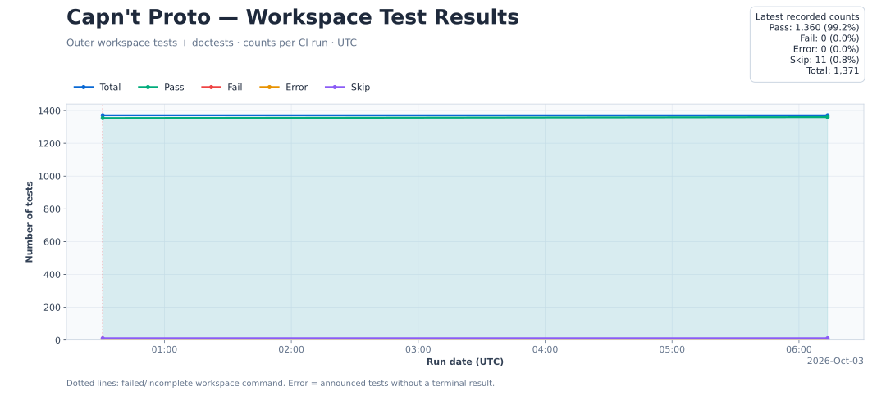

<!-- Generated README: edit docs/README.template.md, then run python3 scripts/update_readme.py render. -->
# Capn't Proto

A Rust implementation of Cap'n Proto schemas, serialization and capability RPC,
with a native schema compiler, compatibility adapters, encrypted transport and
correctness tooling.

**Experimental developer preview.** The project includes coordinated Rust forks
and independent comparisons against pinned C++ Cap'n Proto. It is not affiliated
with the upstream Cap'n Proto project. Full API parity and production
qualification remain work in progress; see the [release criteria](docs/RELEASE_ACCEPTANCE.md).

## What is here

- **Native schema compiler:** imports, generics, constants, annotations, runtime
  reflection and concurrent parser caches. [Compiler guide](crates/capnp-compiler/README.md).
- **Serialization and capability RPC:** maintained `capnp`, `capnpc` and
  `capnp-rpc` crates, with generated Rust APIs and C++ interoperability tests.
  [Runtime scope](docs/RUNTIME_PORT.md) · [C++ parity](docs/CPP_PARITY.md).
- **Optional adapters and transport:** JSON/text codecs, ByteStream, HTTP,
  WebSockets and JSON-RPC; encrypted Noise transport and durable storage.
  [Compatibility adapters](crates/capnp-compat/README.md) · [Architecture](docs/ARCHITECTURE.md).
- **Executable correctness checks:** Rust tests, C++ comparisons, bounded TLA+
  models, fuzzing, memory checks and LLVM coverage regression gates.
  [Testing](docs/TESTING.md) · [Qualification limits](docs/CONFORMANCE.md).

## Build and test

Use the pinned **Rust 1.97.0** toolchain. The full suite also needs CMake, a C++
compiler, Cap'n Proto headers/tools and Java 17; the [setup guide](docs/PREVIEW.md)
and [CI prerequisites](.github/actions/quality-setup/action.yml) describe them.

```sh
# Git checkouts only; source bundles already include the C++ reference.
git submodule update --init --depth 1 -- vendor/capnproto
bash scripts/setup-auditable.sh
export PATH="$PWD/target/auditable-tools/wrapper:$PWD/target/auditable-tools/bin:$PATH"
cargo build --locked -p reproto --lib --bins
cargo test --workspace
```

The C++ reference is pinned as a Git submodule. Ordinary Rust dependencies are
resolved by Cargo; the modified Rust forks remain source dependencies in this
checkout. [Dependency and checkout policy](docs/REPOSITORY_LAYOUT.md#vendored-and-external-code).

The existing Cargo package/import names (`reproto`, `capnp`, `capnpc`, `capnp-rpc`)
remain stable. Capn't Proto is the project name. Use Bash / Git Bash for the setup
commands. Linux, macOS and Windows have compile-and-smoke CI; full verification
and dedicated benchmarks run on Linux.

Benchmarks are separate from tests: CI builds individual release benchmarks with
`cargo bench --no-run`, transfers the artifacts to a temporary dedicated
DigitalOcean droplet, measures Linux loopback RPC and deletes the droplet.
Credentials stay in GitHub Actions secrets. [Benchmark setup](docs/QUALITY.md).

## Documentation and participation

[Documentation index](docs/README.md) · [Repository boundaries](docs/REPOSITORY_LAYOUT.md)
· [Correctness roadmap](docs/CORRECTNESS_ROADMAP.md) · [Reporting and README generation](docs/REPORTING.md)

Read [CONTRIBUTING.md](CONTRIBUTING.md) before submitting changes. Use the
[issue templates](.github/ISSUE_TEMPLATE) for bugs and questions, and follow the
[code of conduct](CODE_OF_CONDUCT.md). Report vulnerabilities privately through
[SECURITY.md](SECURITY.md); the maintainer contact is
[huynhderic@gmail.com](mailto:huynhderic@gmail.com).

Original project code is [MIT licensed](LICENSE). Vendored components retain
their own licenses and [third-party notices](THIRD_PARTY_NOTICES.md).
[GitHub upload/setup instructions](docs/GITHUB_SETUP.md).

## Tests, coverage and benchmarks

Generated automatically from CI evidence. Each lane keeps its own measured commit and date; measurements from different commits are not combined into a single qualification claim.

### Aggregate workspace tests

Awaiting the first full-quality CI run. No historical results have been fabricated.



Counts are outer workspace libtest cases and doctests. Nested C++/model/fuzz checks are represented by their parent test, without double-counting their internal cases. Skipped means ignored; errors mean announced tests that never returned a result. Build failures and missing reports have unknown totals. [Reporting contract and setup](docs/REPORTING.md).

### LLVM coverage

No validated coverage/baseline comparison is available for the latest run. Missing or unmapped counters are never presented as 100% coverage.

### Linux loopback benchmark comparisons

Awaiting the first dedicated DigitalOcean benchmark run.

Separate client/server processes, one outstanding request, several payload sizes and five repetitions. Capn't Proto uses encrypted Noise/UDP; C++ Cap'n Proto, gRPC and WebSocket baselines use plaintext TCP. Bars compare this workload, not universal protocol performance.


[Machine-readable history and exact plotted values](docs/reports/history.json). Full logs, raw samples and LLVM exports are retained in the linked workflow artifacts.

