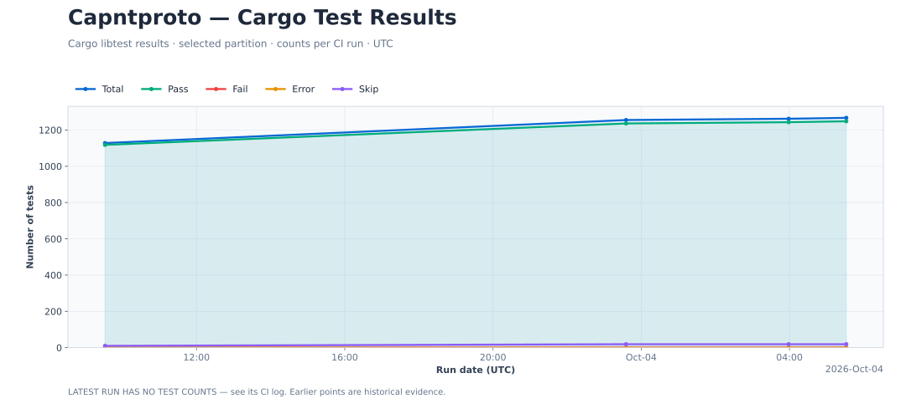
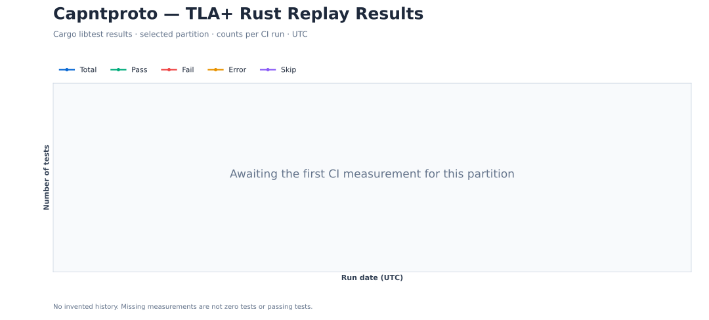
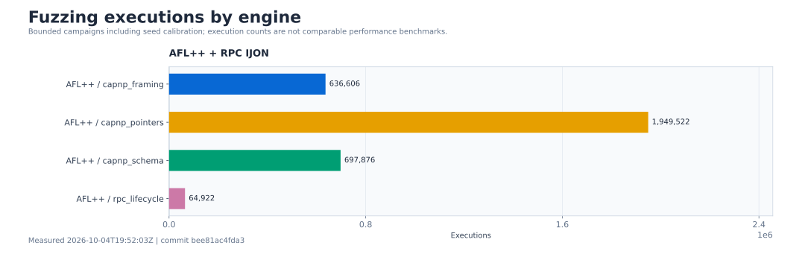
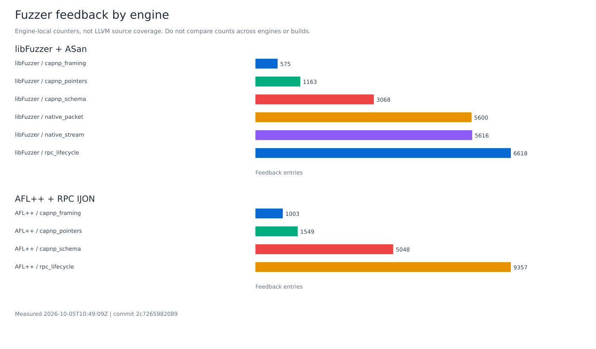
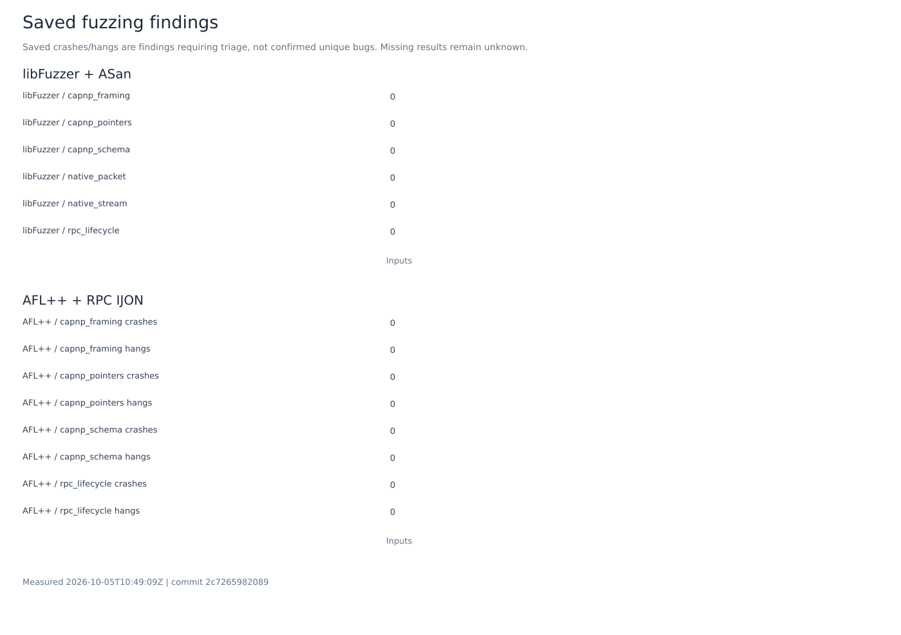
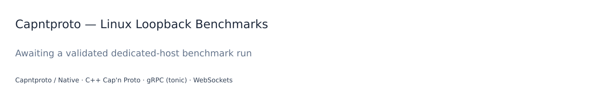

<!-- Generated README: edit docs/README.template.md, then run python3 scripts/update_readme.py render. -->
# Capntproto

[](https://github.com/DericHuynh/capntproto/actions/workflows/ci.yml)
[](https://github.com/DericHuynh/capntproto/actions/workflows/verification-tests.yml)
[](https://github.com/DericHuynh/capntproto/actions/workflows/verification-models.yml)
[](https://github.com/DericHuynh/capntproto/actions/workflows/verification-fuzz.yml)
[](https://github.com/DericHuynh/capntproto/actions/workflows/performance.yml)
[](rust-toolchain.toml)
[](LICENSE)

A Rust implementation of Cap'n Proto schemas, serialization and capability RPC,
with a native schema compiler, compatibility adapters, encrypted transport and
correctness tooling. Start with the **[project wiki](docs/wiki/Home.md)**.

**Experimental developer preview.** The project includes owned Rust protocol crates
and independent comparisons against pinned C++ Cap'n Proto. It is not affiliated
with the upstream Cap'n Proto project. Full API parity and production
qualification remain work in progress; see the [release criteria](docs/wiki/Release-Acceptance.md).

## What is here

- **Native schema compiler:** imports, generics, constants, annotations, runtime
  reflection and concurrent parser caches. [Compiler guide](docs/wiki/Schema-Compiler.md).
- **Serialization and capability RPC:** maintained `capnp`, `capnpc` and
  `capnp-rpc` crates, with generated Rust APIs and C++ interoperability tests.
  [Runtime scope](docs/wiki/Runtime-Status.md) · [C++ parity](docs/wiki/Cpp-Parity.md).
- **Adapters and transport:** TCP, TLS 1.3 and standard QUIC v1 with optional mutual
  TLS; JSON/text codecs, ByteStream, HTTP, WebSockets and JSON-RPC; encrypted
  multiparty sessions through quiche and durable storage. [TCP, TLS and QUIC guide](docs/wiki/TCP-TLS-and-QUIC.md).
  [Compatibility adapters](docs/wiki/Compatibility-Adapters.md) · [Architecture](docs/wiki/Architecture.md).
- **Executable correctness checks:** Rust tests, C++ comparisons, bounded TLA+
  models, fuzzing, memory checks and LLVM coverage regression gates.
  [Testing](docs/wiki/Testing.md) · [Qualification limits](docs/wiki/Model-Conformance.md).
- **RPC application APIs:** owned connections and native vats, typed bootstraps
  after startup, peer-specific bootstrap factories, automatic three-party
  capability handoff and joins. [RPC guide](docs/wiki/RPC-Applications.md).
- **Storage and ORM:** whole-entry objects plus opt-in component revisions that
  share unchanged data, mapped typed reads and atomic publication.
  [Component storage](docs/wiki/Component-Storage.md).

## Build and test

Use the pinned **Rust 1.97.0** toolchain. The full suite also needs CMake, a C++
compiler, libclang, Cap'n Proto headers/tools and Java 17; the [setup guide](docs/wiki/Getting-Started.md)
and [CI prerequisites](.github/actions/quality-setup/action.yml) describe them.

```sh
# Git checkouts only; source bundles already include the C++ reference.
git submodule update --init --depth 1 -- vendor/capnproto
bash scripts/setup-auditable.sh
export PATH="$PWD/target/auditable-tools/wrapper:$PWD/target/auditable-tools/bin:$PATH"
cargo build --locked -p capntproto --lib --bins
cargo test --workspace
```

The C++ reference is pinned as a Git submodule. Ordinary Rust dependencies are
resolved by Cargo; the maintained Rust implementations live in this workspace under `crates/`.
Quiche is the unmodified 0.30.0 registry package; QUIC v2 is currently unsupported. [Dependency and checkout policy](docs/wiki/Repository-Layout.md#vendored-and-external-code).

Our crates use `capntproto`, `capntproto-compiler`, `capntproto-compat` and the
`capntproto-` prefix for supporting tools. Upstream dependencies retain their
`capnp`, `capnpc` and `capnp-rpc` names. See the [name migration](docs/wiki/Repository-Layout.md#crate-name-migration).
Use Bash / Git Bash for the setup
commands. Linux, macOS and Windows have compile-and-smoke CI; full verification
and dedicated benchmarks run on Linux.

Benchmarks are separate from tests: CI builds individual release benchmarks with
`cargo bench --no-run`, transfers the artifacts to a temporary dedicated
DigitalOcean droplet, measures Linux loopback RPC and deletes the droplet.
Credentials stay in GitHub Actions secrets. [Benchmark setup](docs/wiki/Quality-and-Benchmarks.md).
The [CI workflow graph](docs/wiki/Quality-and-Benchmarks.md#workflow-dependencies)
shows the validation gates and how coverage and benchmark results reach this README.
Status badges link to workflow runs; the coverage badge reports verification
status, not a coverage percentage.

## Documentation and participation

[Project wiki](docs/wiki/Home.md) · [Repository boundaries](docs/wiki/Repository-Layout.md)
· [Correctness roadmap](docs/wiki/Correctness.md) · [Reporting and README generation](docs/wiki/README-Reports.md)

Read [CONTRIBUTING.md](CONTRIBUTING.md) before submitting changes. Use the
[issue templates](.github/ISSUE_TEMPLATE) for bugs and questions, and follow the
[code of conduct](CODE_OF_CONDUCT.md). Report vulnerabilities privately through
[SECURITY.md](SECURITY.md); the maintainer contact is
[huynhderic@gmail.com](mailto:huynhderic@gmail.com).

Original project code is [MIT licensed](LICENSE). Vendored components retain
their own licenses and [third-party notices](THIRD_PARTY_NOTICES.md).
[GitHub upload/setup instructions](docs/wiki/GitHub-Setup.md).

## Tests, coverage and benchmarks

Generated automatically from CI evidence. Each lane keeps its own measured commit and date; measurements from different commits are not combined into a single qualification claim.

### Cargo tests

Latest Cargo run: [2026-10-03T09:31:53Z · run 37113359978 / attempt 1](https://github.com/DericHuynh/capntproto/actions/runs/37113359978) · commit `7b0a5aafb6a5` · **failure**



| Total | Passed | Failed | Errors | Skipped |
| ---: | ---: | ---: | ---: | ---: |
| 1,128 | 1,118 | [0](docs/reports/failed-tests.md) | 0 | 10 |

[Show all failed tests and diagnostics](docs/reports/failed-tests.md). Cargo tests and doctests exclude the dedicated TLA+, fuzz, Miri and mutation campaigns. Filtered tests are not counted as passes or skips. [Reporting contract](docs/wiki/README-Reports.md).

### TLA+ models and Rust trace replays

Awaiting the first dedicated CI run; no measurements have been invented.



[Failed model replay tests](docs/reports/failed-models.md). Expected mutation counterexamples are successful checks, not unexpected failures.

### Fuzzing: libFuzzer and AFL++

[2026-10-03T23:12:46Z · run 37161030846 / attempt 1](https://github.com/DericHuynh/capntproto/actions/runs/37161030846) · commit `ed95a35ac251` · **success**



Bounded campaigns including seed calibration; execution counts are not comparable performance benchmarks.



Engine-local counters, not LLVM source coverage. Do not compare counts across engines or builds.



Saved crashes/hangs are findings requiring triage, not confirmed unique bugs. Missing results remain unknown.

AFL++ guides the RPC lifecycle oracle with IJON state and progress annotations. Corpus inputs, crashes, hangs, logs and engine statistics are retained in the linked run. Fuzzer counters are not source coverage percentages.

### LLVM coverage

No validated coverage/baseline comparison is available for the latest run. Missing or unmapped counters are never presented as 100% coverage.

### Linux loopback benchmark comparisons

Latest benchmark run: [2026-10-03T23:55:14Z · run 37163285272 / attempt 1](https://github.com/DericHuynh/capntproto/actions/runs/37163285272) · commit `6d405635f78a` · **failure**

Separate client/server processes, one outstanding request, several payload sizes and five repetitions. Capntproto uses encrypted Native/UDP; C++ Cap'n Proto, gRPC and WebSocket baselines use plaintext TCP. Bars compare this workload, not universal protocol performance.



[Machine-readable history and exact plotted values](docs/reports/history.json). Full logs, raw samples and LLVM exports are retained in the linked workflow artifacts.

