# Capntproto verification reports

[Project and supported APIs](https://github.com/DericHuynh/capntproto) · [Reporting contract](https://github.com/DericHuynh/capntproto/blob/main/docs/wiki/README-Reports.md)

This branch contains generated evidence only. See each result's measured commit
and workflow link before comparing it with a source checkout.

## Tests, coverage and benchmarks

Generated automatically from CI evidence. Each lane keeps its own measured commit and date; measurements from different commits are not combined into a single qualification claim.

### Cargo tests

Latest Cargo run: [2026-10-07T02:35:55Z · run 37562742141 / attempt 1](https://github.com/DericHuynh/capntproto/actions/runs/37562742141) · commit `d2b163dbf50c` · **success**

| Total | Passed | Failed | Errors | Skipped |
| ---: | ---: | ---: | ---: | ---: |
| 1445 | 1425 | [0](docs/reports/failed-tests.md) | 0 | 20 |

[Show all failed tests and diagnostics](docs/reports/failed-tests.md). Cargo tests and doctests exclude the dedicated TLA+, fuzz, Miri and mutation campaigns. Filtered tests are not counted as passes or skips. [Reporting contract](https://github.com/DericHuynh/capntproto/blob/main/docs/wiki/README-Reports.md).

### TLA+ models and Rust trace replays

[2026-10-07T02:35:55Z · run 37562742141 / attempt 1](https://github.com/DericHuynh/capntproto/actions/runs/37562742141) · commit `d2b163dbf50c` · **success**

Unique module&#47;configuration&#47;expected&#45;exit checks&#46; Expected invariant violations are successful controls&#46;

Counts sum independent bounded configurations&#59; they are not globally distinct states or a proof beyond those bounds&#46;

[Failed model replay tests](docs/reports/failed-models.md). Expected mutation counterexamples are successful checks, not unexpected failures.

### Fuzzing: libFuzzer and AFL++

[2026-10-07T02:35:55Z · run 37562742141 / attempt 1](https://github.com/DericHuynh/capntproto/actions/runs/37562742141) · commit `d2b163dbf50c` · **success**

Bounded campaigns including seed calibration&#59; execution counts are not comparable performance benchmarks&#46;

Engine&#45;local counters&#44; not LLVM source coverage&#46; Do not compare counts across engines or builds&#46;

Saved crashes&#47;hangs are findings requiring triage&#44; not confirmed unique bugs&#46; Missing results remain unknown&#46;

AFL++ guides the RPC lifecycle oracle with IJON state and progress annotations. Corpus inputs, crashes, hangs, logs and engine statistics are retained in the linked run. Fuzzer counters are not source coverage percentages.

### LLVM coverage

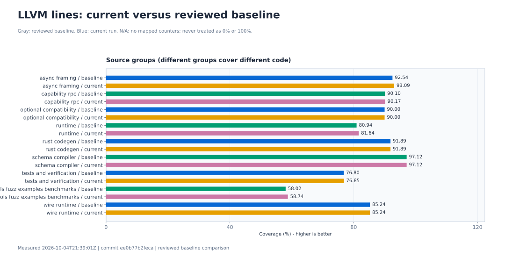

Gray&#58; reviewed baseline&#46; Blue&#58; current run&#46; N&#47;A&#58; no mapped counters&#59; never treated as 0&#37; or 100&#37;&#46;

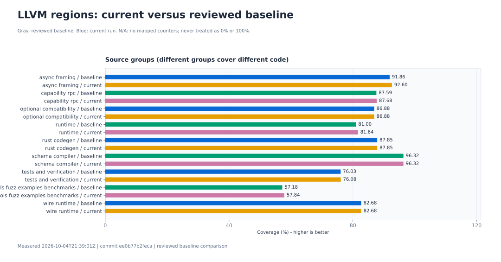

Gray&#58; reviewed baseline&#46; Blue&#58; current run&#46; N&#47;A&#58; no mapped counters&#59; never treated as 0&#37; or 100&#37;&#46;

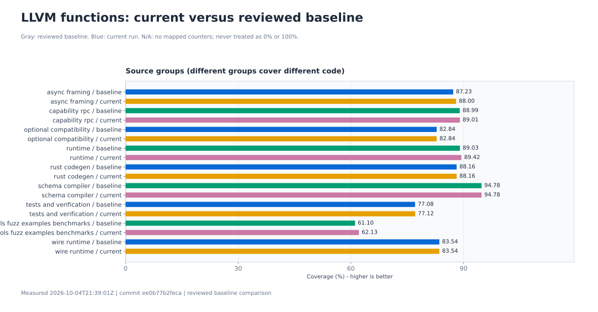

Gray&#58; reviewed baseline&#46; Blue&#58; current run&#46; N&#47;A&#58; no mapped counters&#59; never treated as 0&#37; or 100&#37;&#46;

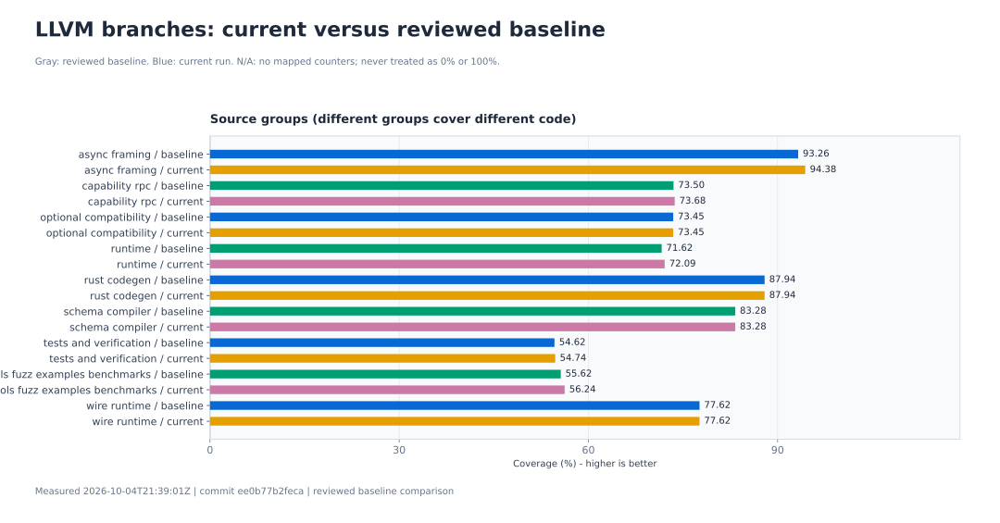

Gray&#58; reviewed baseline&#46; Blue&#58; current run&#46; N&#47;A&#58; no mapped counters&#59; never treated as 0&#37; or 100&#37;&#46;

### Linux loopback benchmark comparisons

Latest benchmark run: [2026-10-07T02:35:55Z · run 37562742141 / attempt 1](https://github.com/DericHuynh/capntproto/actions/runs/37562742141) · commit `d2b163dbf50c` · **success**

Separate client/server processes, one outstanding request, several payload sizes and five repetitions. Capntproto uses encrypted Native/UDP; C++ Cap'n Proto, gRPC and WebSocket baselines use plaintext TCP. Bars compare this workload, not universal protocol performance.

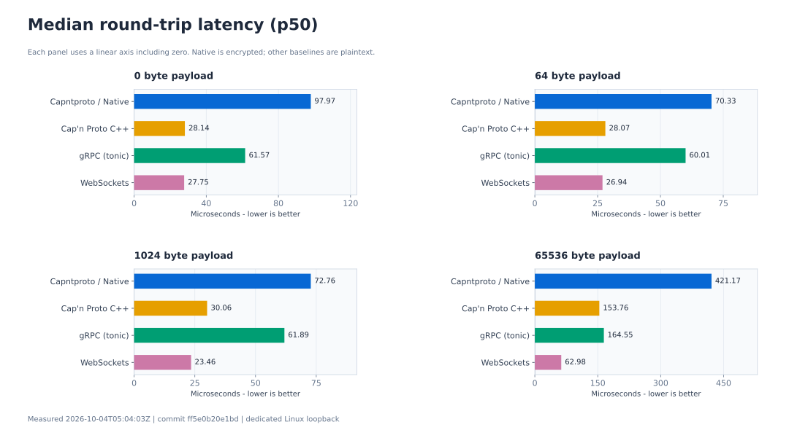

Each panel uses a linear axis including zero&#46; Native is encrypted&#59; other baselines are plaintext&#46;

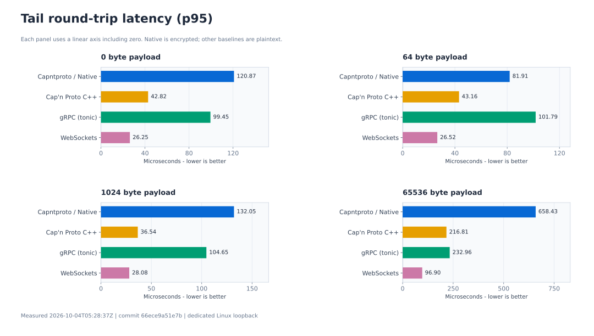

Each panel uses a linear axis including zero&#46; Native is encrypted&#59; other baselines are plaintext&#46;

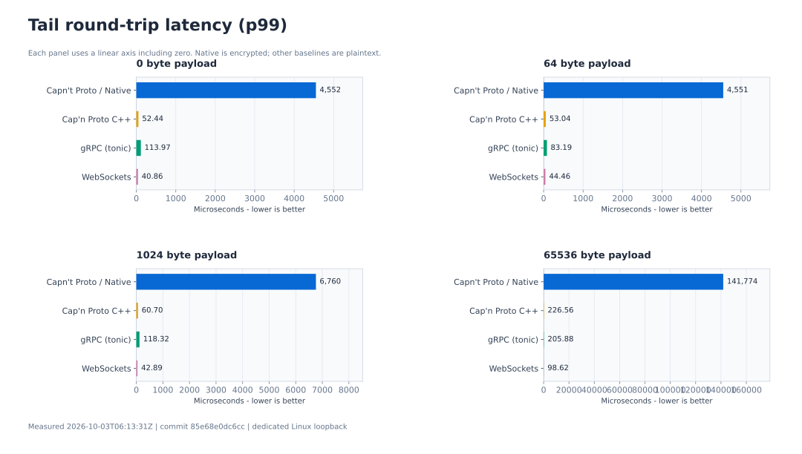

Each panel uses a linear axis including zero&#46; Native is encrypted&#59; other baselines are plaintext&#46;

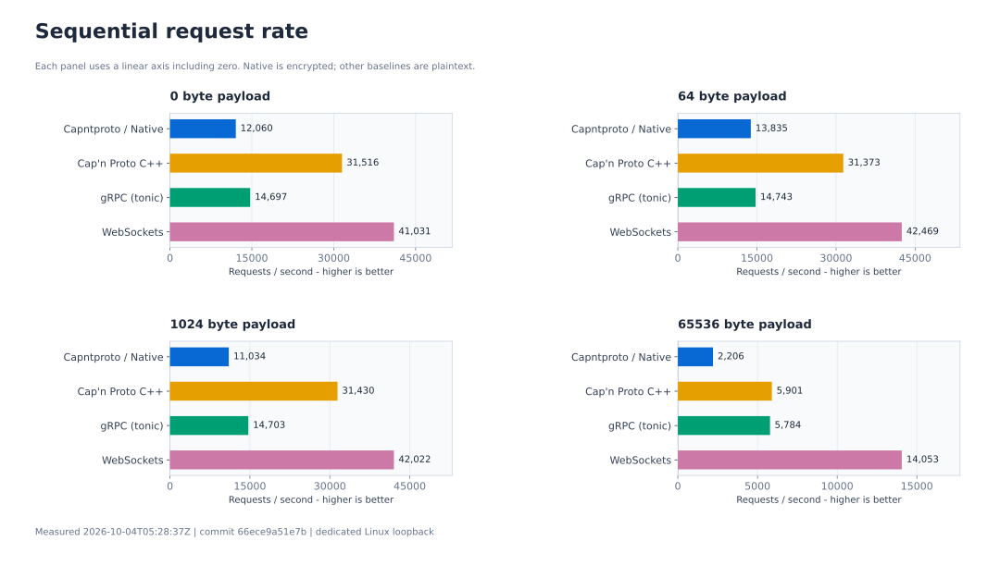

Each panel uses a linear axis including zero&#46; Native is encrypted&#59; other baselines are plaintext&#46;

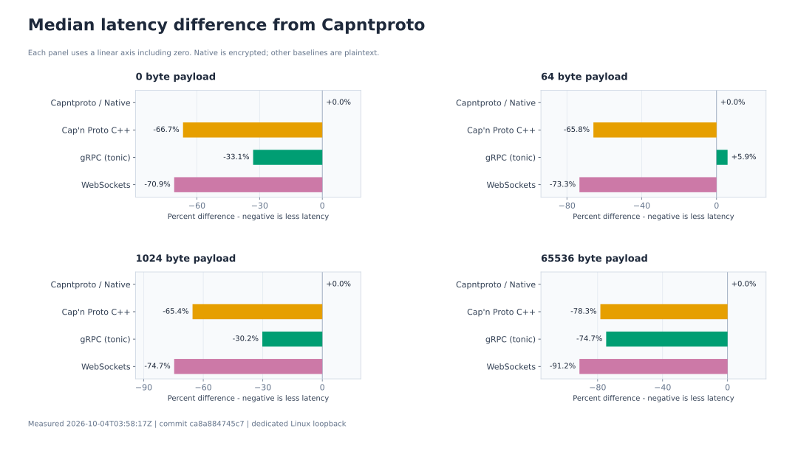

Each panel uses a linear axis including zero&#46; Native is encrypted&#59; other baselines are plaintext&#46;

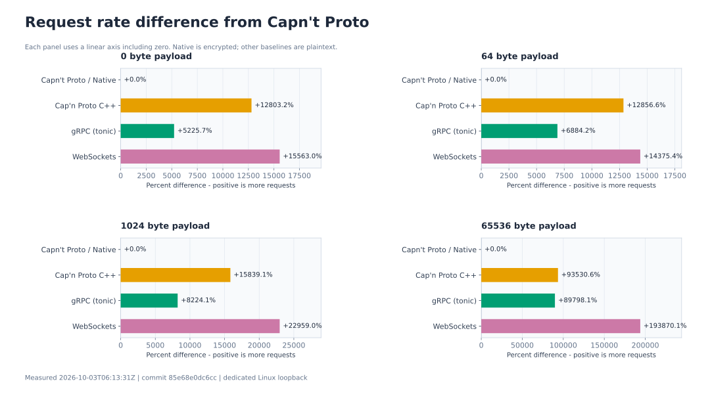

Each panel uses a linear axis including zero&#46; Native is encrypted&#59; other baselines are plaintext&#46;

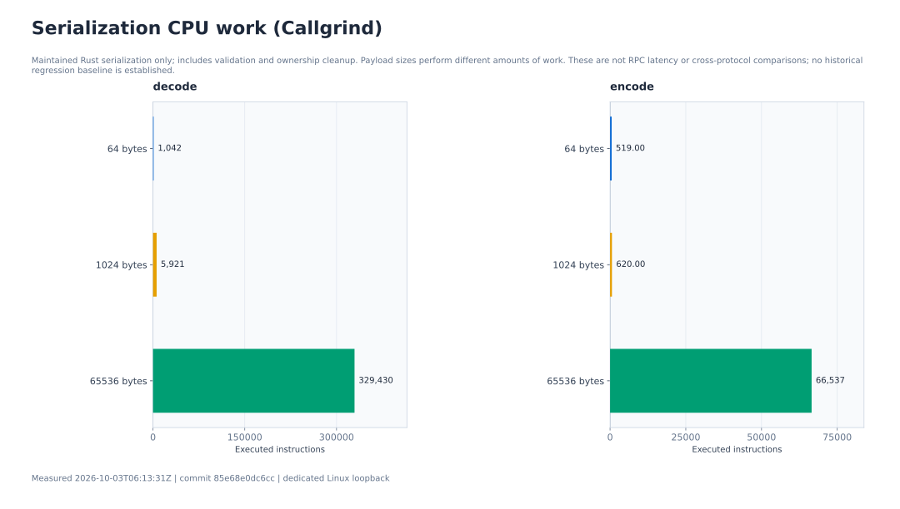

Maintained Rust serialization only&#59; includes validation and ownership cleanup&#46; Payload sizes perform different amounts of work&#46; These are not RPC latency or cross&#45;protocol comparisons&#59; no historical regression baseline is established&#46;

[Machine-readable history and exact plotted values](docs/reports/history.json). Full logs, raw samples and LLVM exports are retained in the linked workflow artifacts.

