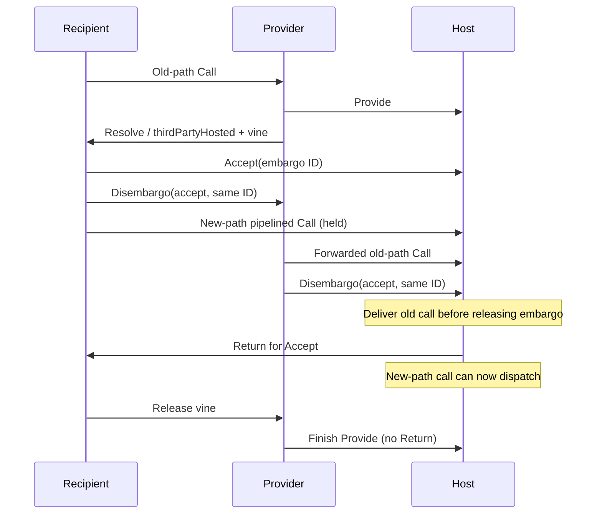

# Protocol comparison and model boundaries

**Audit status:** this mapping is not a conformance proof. [CONFORMANCE.md](CONFORMANCE.md) records the pre-repair findings; [HANDOFF.md](HANDOFF.md) describes runtime handoff and payload-capability changes addressing the first two. Dependencies on auxiliary state and ideal transport contracts remain. Read the mappings below as descriptions of selected modeled mechanisms, subject to those limits.

Normative baseline: `vendor/provenance/rpc.capnp`, `vendor/provenance/rpc-twoparty.capnp`, and `vendor/provenance/persistent.capnp`, commit `0de72d8d8cec6b69edaa29de51d3bd490341f9c2`. Source line numbers below refer to these pinned files.

Additional component contracts for schema transmission, bulk transfer, and encrypted transport are mapped separately in [FEATURES.md](FEATURES.md); the proposed realtime interface and timing rules are in [REALTIME.md](REALTIME.md). They do not change this composed RPC model or discharge its ideal-transport assumptions.

## Comparison with the supplied model

The supplied model fixed two vats, one connection, one implicit root capability per direction, one valid pipeline transform, and fresh local result objects. It modeled only Call/Return/Finish and deliberately fixed the optimization flags off. There were no import/export tables, capability descriptors, Resolve, Disembargo, Provide/Accept, ThirdPartyAnswer, Join, or persistence semantics.

`CapnpNetwork` preserves reception, dispatch, completion, and reply as separate actions, and composes the missing mechanisms in one state machine. Every question-creating message uses `Ask`, `Return`, `Finish`, and the same numeric namespaces. Forwarding allocates ordinary downstream questions; adoption reserves the callee-allocated class. Every exporting descriptor uses the same import/export accounting. The earlier focused modules remain regression checks, including the two-party transport adapter and the four-party Tribble scenario.

## Composed execution

`CapnpNetwork.tla` is the primary executable model. `net` holds all directed FIFO queues, connection epochs, question/answer slots, import/export entries, local promises, proxy links, and transport rendezvous. Request, Return, Finish, Release, and Resolve messages traverse those queues. Numeric IDs are looked up in the receiving connection's table; operation tokens record incarnations and causal links. Calls and barriers receive a local arrival ordinal at each vat. Dispatch uses those local queues, rather than global invocation order.

| Mechanism | Composed operators |
| --- | --- |
| Shared allocation, lifetime, crossed messages | `Ask`, `ReceiveRequest`, `ReceiveReturn`, `ReceiveFinish`, `Reap` |
| Descriptors and ownership | `EncodeOne`, `EncodePayload`, `DecodePayload`, `ImportCredits`, `ReleaseImports`, `ReleaseExports`, `ReleaseUnused` |
| Content and promised-answer transforms | `WalkContent`, `AtPath`, `DecodeTarget`, `Follow` |
| Local/proxy dispatch and dependent cancellation | `Dispatch`, `Forward`, `HasDependents`, `Cancel`, `CompleteForward` |
| Local and third-party redirected results | `Adopt`, `ReceiveAdoption`, `LinkAdoption`, `SettleRedirect`, `FinishRedirect` |
| Promise resolution, introductions, vines | `EncodeOne`, `RegisterOffers`, `ResolveExport`, `ReceiveResolve`, `RegisterProvide`, `CloseVine` |
| Runtime handoff and capability routing | `StartHandoff`, `ClientRef`, `FinishHandoff`, `ImportInUse` |
| Accept and embargo routing | `CompleteAccept`, `ReceiveDisembargo`, `DispatchBarrier` |
| Distributed equality | `CompleteJoin`, `JoinResultsReady`, `JoinCompatible`, `JoinConnect` |
| Unsupported messages and connection failure | `ReceiveUnimplemented`, `Abort`, `Close` |
| Persistence and recovery | `Complete` save/restore methods and reconnect workloads |

An import is retained while an exported proxy, an active call, a stored resolution, or an unfinished introduction needs it. Implicit release flags are cleared when such a reference must survive; explicit Release performs later cleanup. A pending question exported as a promise retains its wire address until it resolves or the export is dropped; queued local pipelines are forwarded before closing their downstream question. Finish on an original redirected call propagates down its forwarding path and separately closes the caller's adopted question. Adoption is linked before results arrive, allowing cancellation of unresolved third-party calls. Loss of the adopted connection, or failure to establish it, settles the original result through the VatNetwork completion contract. Failed rendezvous records allocate no RPC table slot and send no fabricated ThirdPartyAnswer. A Finish received before forwarding is propagated when the downstream question is created. Provide has no Return. Join roots retain resources until Finish while historical join groups remain as proof observers.

`content` is a finite graph separate from the capability table. A pipeline follows zero-based pointer indices and no-op operations through that graph. Raw bootstrap/Accept capabilities have an empty transform; ordinary method results have a struct root. The executable application supplies flat, duplicate-capability, and nested payloads, along with echo, factory, promise, tail, save and restore methods.

The table below also identifies focused regression modules. Those checks supplement the composed checks; a component result is not counted as a composed-network result.

## Wire correspondence

| Schema element | Source lines | Model interpretation |
| --- | --- | --- |
| Four tables and disconnect | rpc 116–205 | Question/answer tables in `CapnpRpc`; import/export tables in `CapnpCapabilities`. Disconnect clears connection-local state. |
| `Message.unimplemented` | rpc 216–232 | `CapnpCompatibility`: question failures, Resolve replacement-credit recovery; permitted abort policy for other unsupported operations. |
| `Message.abort` | rpc 234–240 | `CapnpCompatibility`: outgoing half-close followed by teardown. Failure actions in other components abstract completed detection. |
| `Bootstrap` | rpc 279–391 | A question returning a raw capability, empty pipeline transform, ordinary Finish lifetime. Missing bootstrap may return an exception. Deprecated object IDs are not a Restore mechanism. |
| `Call.questionId`, `target` | rpc 398–409 | Per-directed-connection question namespace; imported target or captured promised-answer dependency. `CapnpWire.Target` specifies lookup and transform evaluation. |
| `Call.interfaceId`, `methodId` | rpc 411–415 | Opaque application dispatch selectors. Application execution is abstracted by dispatch/completion. |
| Call flags | rpc 417–444 | Direct-return permission in `CapnpTailCall`; separate lifecycle modes in `CapnpRpc`. See flag restrictions below. |
| `Call.params` / `Payload` | rpc 446, 1036–1045 | Content graph interpretation in `CapnpWire`; descriptor credits in `CapnpCapabilities`. Serialized bytes and application data are abstract. |
| `sendResultsTo.caller` | rpc 453 | Ordinary lifecycle in `CapnpRpc`. |
| `sendResultsTo.yourself` | rpc 456–492 | `CapnpTailCall`: locally retained result; `resultsSentElsewhere` still goes back to the forwarding caller. |
| `sendResultsTo.thirdParty` | rpc 494–505 | `CapnpTailCall`: connection adoption via ThirdPartyAnswer followed by a Return on the new connection. |
| `Return.answerId` | rpc 514–515 | Lookup by numeric ID in the corresponding question table, never by ghost invocation token. |
| `Return.releaseParamCaps` | rpc 517–525 | Implicit release consumes one credit per original descriptor; credits cannot also be explicitly released. |
| `Return.noFinishNeeded` | rpc 527–532 | Capability-free result mode; answer freed at Return send, question freed at Return receive. Crossed Finish is ignored. |
| `Return.results`, `exception`, `canceled` | rpc 535–549 | Outcome values in lifecycle; cancellation requires Finish and preserves already captured dependencies. |
| `Return.resultsSentElsewhere` | rpc 551–557 | Completes the forwarding question without transmitting its result payload. |
| `Return.takeFromOtherQuestion` | rpc 559–562 | A previously sent opposite-direction `yourself` call supplies the result; Finish chains to the forwarding call. One consumer in the bounded tail-call scenario. |
| `Return.awaitFromThirdParty` | rpc 564–570 | Redirect announcement is required before a received third-party result becomes observable; only permitted when authorized by the original Call. |
| `Finish` | rpc 573–616 | Close pipeline address/interest; optional cancellation, result-credit release, legacy dispatch-before-cancellation behavior. |
| `Resolve` | rpc 620–676 | One resolution per exported promise incarnation; does not increase promiseId's count; its replacement descriptor does. Discarded/unsupported resolutions release that replacement. |
| `Release` | rpc 684–695 | Batched credit decrement; exporter and importer counts differ while descriptors/releases are in flight. |
| `Disembargo.senderLoopback`, `receiverLoopback` | rpc 781–794 | Echo barrier in `CapnpEmbargo`; invalid target location is rejected in `CapnpCompatibility`. |
| `Disembargo.accept` | rpc 796–815 | Per-recipient barrier in `CapnpHandoff`; may precede the matching Accept. Both Return and pipelined delivery wait. |
| `Provide` | rpc 824–853 | Registered provision with no Return; held until acceptance/vine confirmation or proxy fallback closes it with Finish. |
| `Accept` | rpc 856–903 | Rendezvous can begin before Provide arrives; authenticated completion and matching embargo are required. Ordinary answer lifetime is the lifecycle component's contract. |
| `ThirdPartyAnswer` | rpc 906–943 | Can arrive before the redirect announcement; reserves callee-allocated IDs `[2^30,2^31)`, distinct from ordinary and pipeline-only IDs. |
| `Join` | rpc 946–1012 | Independent shares travel along capability paths to transparent-proxy roots; local root groups produce host/ordinal results; all shares for one object authorize the direct connection. |
| `CapDescriptor` | rpc 1047–1146 | Six alternatives interpreted in `CapnpWire`; hosted/promise credits in accounting; third-party introduction and vine in handoff. `receiverHosted` returns an existing receiver export, not a new export credit. |
| `PromisedAnswer.transform` | rpc 1170–1212 | `noop` and zero-based pointer-section indexing through a content graph. Missing/nonstruct/noncap targets yield broken targets. Bootstrap uses an empty transform. |
| `ThirdPartyCapDescriptor` | rpc 1215–1237 | Introduction token and live vine. Level 1/2 proxy calls use the vine and terminate the unused provision. |
| `Exception` | rpc 1240–1350 | Failed/overloaded/disconnected/unimplemented categories inventoried. Text, trace, details, and obsolete diagnostic fields have no ordering/ownership effects in these models. |
| `Persistent.save` | persistent 29–126 | Ordinary capability method producing a realm-defined sturdy reference, optionally sealed to an owner. Transient references die on disconnect; sturdy references do not. |
| Two-party JoinKeyPart / JoinResult | rpc-twoparty | Collect all parts before forwarding across the two-party boundary. Local same-import equality avoids another join. All responses agree; one successful response carries the capability. |

`obsoleteSave`, `obsoleteDelete`, and `Bootstrap.deprecatedObjectId` are obsolete. The models do not revive them as persistence operations. The optional attached-FD index is interpreted by `CapnpWire.AttachedFd`; operating-system descriptor ownership and application FD semantics are outside RPC ordering.

## Three-party transfer

`CapnpHandoff` uses provider 2, host 3, and recipient 1; an additional recipient 4 exercises forwarded introduction and distinct embargo IDs for a shared provision. The initial old-path calls and subsequent direct calls share logical reference identity. Each directed link has one FIFO for all message kinds. No ordering is imposed between separate links.

The host may receive Accept before Provide, or Disembargo before Accept. It records each half of the rendezvous. It cannot deliver the new-path call or return the accepted capability until both rendezvous and embargo complete. Old-path calls reach the host ahead of the Disembargo on the provider-to-host FIFO. Thus ordering follows from the protocol, not a scheduler guard that directly checks the desired delivery history.

Vines remain live until acceptance completes. A forwarded-recipient scenario aggregates downstream vine ownership before the provider sends Finish. In the fallback scenario, a Call to the vine causes the provider to forward that call and close Provide; the vine remains a proxy. It does not require successful direct acceptance.

An Accept's captured capability remains usable after the original provision is unregistered. `Ready` therefore also recognizes an already returned acceptance, rather than requiring Provide to remain open forever.

The diagram is one permitted interleaving. The checker also explores Accept arriving before Provide and Disembargo arriving before Accept.

## Promise shortening and the Tribble race

The old promise's forwarding edge remains pinned to the exact reference announced in Resolve, even if that reference is another promise which later resolves elsewhere. `CapnpEmbargo` checks this rule for a two-promise chain and a loopback endpoint. The negative control that shortcuts the second promise violates `PinnedForwarding`. The handoff model separately checks new-path call delivery against the actual asynchronous embargo.

## Distributed equality

Join is not `objectIdA = objectIdB` at the requesting vat. Each path carries a separate secret-key share and returns a transport-specific JoinResult. The bounded transport instance represents a JoinResult with a host identity plus a locally assigned ordinal for the receiving object/group. Conflicting hosts fail. Two different objects on the **same** host also fail because they produce duplicate ordinals rather than a full `0..NParts-1` set.

Before successful direct acceptance, the ideal transport requires every distinct key-part label for one root. A result set alone is insufficient authentication. In the composed model this is a check over shared root groups, followed by installing an authentication grant. Freshness, secrecy, and restrictions on intermediate-proxy knowledge are transport assumptions; they are not verified per-vat knowledge properties. It does not model cryptanalysis or malicious colluding transports.

Transparent proxies forward Join. Opaque proxies terminate it at their own identity; the model does not bypass them to claim their hidden target is equal. Return may be sent for an individual part before the other parts arrive. Finish flows back down each path only after the requester has completed or canceled the operation, and relay release follows upstream release. Historical group membership remains as ghost state; `rootReleased` identifies released operation resources.

`CapnpTwoPartyJoin` models the different contract in `rpc-twoparty.capnp`, rather than incorrectly applying the generic host/ordinal result shape to every transport.

## Lifetime flags and finite IDs

The lifecycle modes are representative policies:

- `ordinary`: Return and Finish both required before question-ID reuse.
- `bootstrap`: same lifetime, raw capability result/empty transform contract.
- `noPipeline`: the caller does not issue pipelined calls on that question.
- `noFinish`: results contain no capabilities; the answer is freed at Return send and the question at Return receive. An already sent Finish can cross the Return.
- `pipelineOnly`: the callee honors the hint and omits Return; Finish ends the question/answer state.
- `pipelineCompat`: the callee may send a Return despite the pipeline-only hint, including after Finish. Late replies are discarded.
- `workaround`: cancellation before dispatch is deferred, as required by the legacy flag.

Pipeline-only numeric IDs are not wrapped/reused in a finite run. This is a conservative finite allocation policy, **not** a claim that Finish alone makes arbitrary ID reuse safe with an old peer. The schema's 2^31-ID wrap heuristic is not executable at these bounds. `CapnpTailCall` represents 32-bit namespaces as `<<highTwoBits, low30Bits>>` because TLC's built-in integers are signed 32-bit.

The model does not enumerate the full Cartesian product of call flags. It also conservatively excludes pipelines on a `noFinish` result instead of modeling such pipelines as failed capability lookups. These are scenario restrictions, not additional requirements imposed by the protocol.

## Abstraction and verification boundaries

1. The composed network checks enumerate all reachable interleavings for each configured finite application workload. They do not enumerate all possible applications, arbitrary proxy depth, arbitrarily many concurrent joins, or all combinations of flags. There are no state constraints silently pruning a configured graph. Workload prerequisites and finite pools are explicit in `CapnpNetworkChecks.tla` and `verification/configs/Network*.cfg`.
2. Ordinary, callee-allocated and pipeline-only numeric ID ranges are represented by disjoint classes with small numeric pools. Pipeline-only IDs are not reused in a workload, allowing late Returns from peers that ignore the hint. Local generations prevent reconnects and ID reuse from reviving stale references.
3. Operation records pair local question/answer observations and retain historical information. Request receipt copies wire method/data; operation identity and other metadata remain paired. Credit tickets identify descriptor occurrences for accounting, including in-flight implicit releases; they are not wire fields or a native allocator implementation. Explicit Release decrements the receiver's export count using wire ID/count, then updates the auxiliary ledger. `ReleaseAnnotation` and `RequestPairing` in the audit model state the relation for generated traffic; annotation-erasure checks establish only the explicit Release handler's export/connection projection. Integer counts are checked against the credit ledger. The model is not a refinement proof establishing that these abstractions preserve every concrete implementation behavior. [Boundary checks and Rust replay](CONFORMANCE.md#repaired-wire-handler-boundaries).
4. The environment generates valid peer traffic. Selected unsupported messages, invalid transforms, broken promises, and unauthorized Accepts are exercised. This is not an exhaustive malformed-message parser or Byzantine-adversary model. Transport disconnect detection is atomic; Abort first stops local sending and travels through the FIFO before teardown.
5. With introductions enabled, remote capabilities in Call/Return payloads and Resolve initiate runtime handoffs. Application calls follow the accepted route while old exported promise edges remain pinned. Forwarded multi-recipient introductions and the four-party Tribble case retain focused component checks. The two-party Join adapter remains a focused transport model, not a mode of the composed multi-vat transport.
6. Join shares, authenticated connection establishment, introduction tokens, and persistent realms are ideal transport/application contracts, as permitted by the schema. The caller uses returned host/ordinal metadata; host-local groups require all parts for the same object before acceptance. Secret-share cryptography, key replay prevention, TLS, and concrete transport byte formats are not verified.
7. The finite application methods expose protocol behavior; they do not model arbitrary user code. Exception categories are abstract outcomes. Serialization, OS file-descriptor ownership, native memory reclamation, and C++/Rust conformance are outside this model.
8. Liveness assumes fair delivery, protocol progress, enabled application steps, promise resolution/embargo processing, and unused-reference cleanup, with finite work and sufficient configured IDs. Safety does not require fairness. A workload that intentionally leaves an unresolved promise or withdraws a required provision cannot be expected to satisfy successful-result liveness.

The resulting evidence is bounded verification of a composed RPC abstraction, plus targeted component checks. It is not a claim that every behavior permitted by the full protocol, every VatNetwork, or a production implementation has been proved correct.
