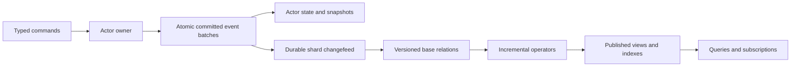

# ActorDB Event Sourcing and Incremental Views Proposal

**Status: Draft proposal. Date: 2026-10-02.** ActorDB is the working name for a
new database we would build on Capnt Actors and Capntproto. This document
proposes its architecture and first delivery scope; it does not describe an
integration with an existing product named ActorDB or an implemented database.

Use actors to validate commands, an event store to retain accepted facts, and
incremental view maintenance (IVM) to keep derived queries current. The first
useful system should prove durable event commits, recoverable projections and
reads that include a caller's own writes. Replication and owner movement must
pass their own gates before the service advertises high availability.

The [implementation checklist](ActorDB-Checklist.md) tracks the proposed work.
The [Capnt Actors specification](<../../Capnt Actors API Specification.md>) owns
actor identity, invocation errors, request fingerprints, transaction fencing,
authority and recovery. This proposal adds a database profile above those
contracts; it does not weaken them or change the generic actor core's scope.

## Goals and first delivery scope

The intended workloads contain many independently updated entities, such as
accounts, orders, documents and rooms, with recurring queries over their state.
Event history supports recovery, audit and rebuilding compatible read models.
IVM updates affected results when inputs change instead of recomputing an entire
query. Event sourcing and IVM are separate choices: IVM also works with ordinary
database changefeeds. Their combination is useful here because history and
replay are product requirements.

The first database profile includes typed commands and queries, event batches,
actor snapshots, indexed current-state relations, keyed projections, filters,
counts and sums. It includes progress receipts, durable projector recovery,
versioned rebuilds, bounded resources and authorization. A replicated milestone
adds owner failover and shard movement. These are proposed requirements, not
features already available in the repository.

General SQL, distributed ACID transactions across actors, arbitrary Rust code
compiled automatically into IVM, general joins, event-time windows and automatic
view selection are later extensions. The initial query surface is typed and
explicit. A single hot actor remains limited by its exclusive write execution;
IVM can scale its reads but does not remove that write constraint.

## Existing foundation and required work

| Area | Available foundation | Work required for this proposal |
| --- | --- | --- |
| RPC and transport | Typed capabilities, pipelines, TCP/TLS and mTLS, quiche QUIC v1/v2 | Database services, bounded batch feeds and control progress |
| Local persistence | V4 whole-entry revisions, V5 component revisions, immutable mapped snapshots and compaction | Atomic actor event/result/effect commits, durable indexes and projection transactions |
| Publication history | Retained per-object publication cursors and explicit history gaps | Shard changefeeds, consumer checkpoints, retention reservations and domain event schemas |
| Actor contracts | A normative design specification | Actor runtime, operation recovery, ownership proofs and placement |
| Incremental queries | No implemented IVM engine | Relation mapping, operators, indexed state, progress tracking and recovery |
| Replication | No replicated actor store | Consensus or equivalent provider, replica recovery and fenced handoff |

The [runtime status](Runtime-Status.md), [storage contract](Storage-and-ORM.md),
[component storage](Component-Storage.md) and [publication history](Publication-History.md)
are the implementation baseline. Current push subscriptions can coalesce updates;
they cannot be the authoritative input to event projections. V5 permits at most
256 structural components per object. A table or event stream therefore needs
an indexed storage design rather than one component per row or event.

## Architecture

Logical actors are independent of physical files, executor threads and
replication groups. Many actors share a storage shard, with bounded writer
queues and group commit where supported. A shard provides an ordered committed
feed; actor identity and event order remain stable when physical ownership
changes. Do not create a file, thread, network subscription or consensus group
for every small actor by default.

Projectors consume batches from durable feeds. Wakeups are latency hints; losing
one must not lose data. Projection workers use their own bounded compute and I/O
capacity so replay or a large join cannot block RPC control or actor ownership
recovery. Executor-local capabilities stay on their owner; transferable batches
cross worker boundaries under the actor specification's type rules.

## Atomic event commits

A command runs against state reconstructed through a known actor revision. It
validates business invariants and stages a batch of domain events. One fenced
provider transaction records the batch, operation fingerprint and encoded
result, event sequence advancement, and any staged outgoing effects. If current
state or relation changes are persisted in that transaction, their versions must
match the same batch. A successful response follows the advertised durability
and replication barrier. A lost response retains recovery for that operation.

Domain rejection follows the actor specification: discard staged business
changes and effects while durably retaining the rejection result. A successful
no-op or rejection may have no domain events; its completion still has a commit
position, and downstream progress must be able to pass that position. Failed
serialization cannot leave a successful mutation with an unreplayable result.

| Record | Required binding |
| --- | --- |
| Actor identity | Tenant, entity kind, canonical key and entity generation |
| Operation | Scoped operation ID, frozen request fingerprint, original contract/schema versions and authority binding |
| Event | Full actor identity, monotonic event sequence, event schema version and owned payload |
| Event batch | Actor revision, operation/input identity, ordered event range, batch digest and commit proof |
| Commit position | Store lineage, shard identity, shard epoch and committed log position |
| Snapshot | Actor identity, covered event sequence/revision, reducer version and state schema |

An event batch is the minimum publication unit. Readers and projectors cannot
observe half its events as a completed actor change. Replicas apply validated
recorded changes under the provider protocol; they must not repeat arbitrary
handler I/O to reconstruct a result. Event reducers are deterministic, perform
no I/O, and use recorded values for time, randomness and generated IDs. Replay
must not resend historical external effects.

The event store is authoritative for domain history. Actor state and compatible
read models are derived data. Actor snapshots accelerate rehydration; they do
not automatically contain enough information to rebuild historical aggregates
or a newly defined projection.

## From events to relational changes

Versioned reducers translate events into current-state relations. For example,
`OrderPaid` changes an order row from `Open` to `Paid`. The mapper emits a
retraction of the old row and an insertion of the new row, allowing a count of
open orders to decrease correctly. It obtains old values from retained reducer
state or an event representation that explicitly contains them.

The proposed IVM input is a typed record, a logical commit time and a signed
multiplicity. Inserts add contributions; retractions remove them. This is
informed by [Materialize's collections and arrangements](https://materialize.com/docs/fundamentals/concepts/arrangements/),
which describe records with logical timestamps and differences plus indexed
representations. Using that model does not inherit Materialize's implementation
or consistency guarantees.

The first operator set is keyed lookup, projection, filtering, count and sum.
Define null behavior, key equality, numeric overflow and deterministic aggregate
semantics before publishing contracts. An update must support both removal and
addition; an append-only event log does not imply that derived relations only
receive inserts. General minimum/maximum, distinct, joins and windows require
additional retained state and qualification.

Domain event time and committed processing order are different fields. The
first profile orders processing by committed positions. A later event-time
window extension must define watermarks, lateness, corrections and finality;
a wall-clock timestamp on an event cannot establish that no older event will
arrive. User functions require declared deterministic behavior and supported
incremental semantics, or an explicit recomputation boundary.

## Projection recovery and publication

Each projection has a stable identity and a generation binding its definition,
input schemas and source lineage. Each committed checkpoint binds input
progress, all operator state needed for recovery, and a published output
revision. Projection updates and their checkpoint must be committed atomically,
or through a qualified recovery protocol with equivalent behavior.

Delivery may repeat. After a crash, the projector resumes from the last committed
checkpoint and cannot count a previously committed input twice. A checkpoint
advances only through a contiguous completed prefix for each input partition;
highest-seen position is insufficient. Retractions, intermediate indexes and
pending operator work are part of recovery state. Persisting final output rows
alone is not enough to resume an in-memory dataflow whose internal state was lost.

For a first implementation, co-locate a projection partition's output and
checkpoint in one transactional provider. Later distributed dataflows need a
coordinated checkpoint/replay protocol. Input replay must preserve operator
semantics, and publication must wait for the corresponding output to be complete.
An equivalent output reconstructed after recovery cannot silently change the
meaning of an already issued progress token.

Subscriptions identify the projection generation and output cursor, bound
retained bytes, and report explicit gaps. Authorization is checked before
returning snapshots or deltas. A disconnected client resumes from a retained
cursor or performs an authorized resynchronization; receipt of an RPC message
is not an acknowledgement that its application processed the update.

## Query consistency and progress receipts

A commit receipt binds the actor revision and a resolvable committed input
position. Projection progress is a frontier: the set of contiguous input
positions covered by a published output. A maximum over unrelated shard
sequence numbers cannot represent that frontier. Tokens bind source lineage,
projection generation and interpretation version, and convey no query authority.

| Proposed read mode | Required behavior |
| --- | --- |
| Current published view | Return one atomically published view revision with its input frontier; it may lag writes and makes no global snapshot claim |
| Include commits | Wait within the caller's budget until the published view covers every supplied commit token, or return a typed timeout/incompatibility failure |
| Bounded staleness extension | Serve only with a source freshness/clock proof establishing the bound; otherwise fail |
| Consistent snapshot across sources extension | Require a provider/dataflow proof of a consistent cut across all relevant inputs; never infer it from actor-local receipts |

The initial read-your-writes guarantee means the input containing a write has
been incorporated. A later write may supersede its visible value, and filters
or access policy may exclude its row. It does not promise an exact historical
value or serializability of a transaction spanning multiple actors. Queries
must read a pinned output revision and its matching frontier, not a progress
counter newer than the data being returned.

Migration preserves a mapping from accepted commit tokens to durable history,
or reports an explicit incompatible lineage. A backup restore that cannot
establish continuity must not reuse the old position space. Shard splits and
merges need explicit progress translation before they can be advertised.
Freshness waiting is a deliberate latency trade-off; [Materialize's isolation documentation](https://materialize.com/docs/serve-results/isolation-level/)
provides an example of separating freshness and snapshot consistency. Our modes
require their own implementation evidence.

## Rebuilds retention and schema evolution

Build a changed projection as a new generation. Select a retained input cut,
load a compatible baseline or replay the required history, catch up through a
recorded frontier, and atomically switch new readers after validation. Retain
the old generation while its bounded readers/cursors remain supported. Compare
incremental output with a full recomputation over the same input cut.

Retention decisions account for replicas, projector checkpoints, rebuilds,
subscriptions and recovery obligations. Consumer reservations are bounded and
visible. When storage cannot retain the promised history, stop new admission or
explicitly suspend affected consumers according to policy; never silently delete
required input. An expired cursor returns a gap, not an empty successful batch.

A current actor snapshot cannot justify pruning events needed by an arbitrary
future historical query. Advertise the retained history horizon and which
baseline formats support which rebuilds. Event upcasters, reducers and
projection definitions are versioned artifacts. Unsupported old input suspends
processing before its cursor advances. Compaction preserves event identity,
order, authorized history semantics and the actor operation retention contract.

## Ownership authority and replication

The database profile requires the actor specification's fenced commit and read
proofs. A local file lock is not a distributed owner fence. A replicated provider
must define quorum/durability acknowledgements, membership changes, uncertain
commit reconciliation, replica bootstrap and restoration of the deduplication
records together with domain data. Group commit retains each actor transaction's
individual outcome and fence check.

Capability relocation follows the existing proposal's restoration/delegation
contract. Copying an owner-sealed token to another host cannot grant restoration
authority. Projection workers receive restricted feed and output grants; clients
receive query rights independently of access to raw events. Tenant boundaries
must survive joins, cached views, rebuilds and subscriptions. User-filtered output
must not be cached and served under another user's authority. Changes to access
policy require a defined invalidation/recheck point.

Use the existing authenticated TCP and quiche transports for database services.
A dataflow library's own distributed transport is not automatically covered by
that authentication or capability model. Any such path must be adapted and
qualified, or kept local behind authenticated services. External effects remain
under the actor outbox contract; an event log does not make an external service
transactional.

## Storage and computation choices

Keep event storage and projection storage behind explicit provider interfaces.
The local Store can support bounded prototypes only where the adapter proves the
combined atomic contract. Durable indexes and efficient retention may need a
new provider or storage layout; do not present the current component format as
a general table engine. Prefer ordinary Cargo dependencies when evaluating
existing engines, with dependency and licensing review before adoption.

Evaluate a small reference projector against [Differential Dataflow](https://timelydataflow.github.io/differential-dataflow/)
for incremental computation. Differential supplies incremental operators in
Rust; that does not settle durable checkpoints, schema upgrades, recovery,
tenancy or integration with this RPC executor. Keep the reference implementation
as a correctness oracle. Choose the engine after a prototype measures recovery,
state size and supported operator semantics alongside update throughput.

Benchmarks must include sustained reads and writes, hot actors, skewed keys,
view fan-out, retractions, retained snapshots, rebuild traffic and slow
consumers. Report commit latency, write-to-view latency, query freshness wait,
bytes persisted, operator memory, recovery time and tail percentiles. Separate
process-only, single-host durable and replicated results. Batching and lower
write amplification are hypotheses to measure, not throughput promises.

## Delivery milestones and decisions

| Milestone | Completion evidence |
| --- | --- |
| Actor prerequisites | Typed recovery, fenced single-host transactions, authority checks and bounded control pass actor acceptance cases |
| Durable event path | Lost replies and process crashes preserve one committed event batch and replayable result per operation |
| Minimal incremental views | Keyed views, filters, counts and sums match full recomputation after duplicates, retractions and restart |
| Progress and rebuilds | Reads include supplied commits; new projection generations rebuild and cut over without history gaps |
| Replicated database | Owner loss and movement preserve events, results, capability authority and query-token meaning |
| Extended query engine | Each additional operator passes correctness, state-bound and recovery gates before being advertised |

A single-host prototype can deliver the first four milestones with an explicit
single-host durability profile. The first replicated MVP requires the fifth and
the common qualification gates in the [checklist](ActorDB-Checklist.md). General
joins and SQL are not prerequisites for that MVP.

Before implementation, resolve the initial event/index storage provider, physical
replication group sizing, projection engine, token/progress encoding, retention
budgets and supported numeric/query semantics. Before replication, select and
qualify the ownership/consensus provider and restoration strategy. Before joins,
choose their cross-source consistency and checkpoint model. No dependency,
consensus implementation or benchmark target is selected merely by this proposal.
