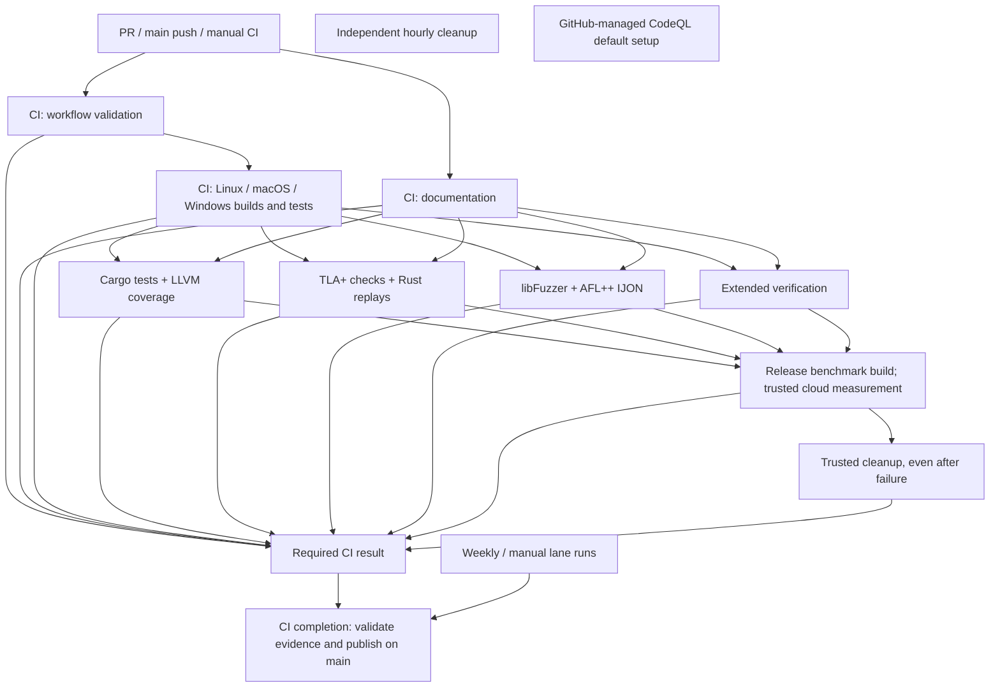

# Quality checks and benchmark reports

Pull requests compile default features on **Linux, macOS and Windows** and run
smoke checks plus selected minimal storage, TLS and QUIC feature profiles.
There is no feature powerset matrix. Full correctness
checks use nextest and a separate doctest command on the supported Linux verification host:

```sh
cargo nextest run --locked --workspace
cargo test --locked --workspace --doc
```

These commands cover unit/integration tests, doctests, bounded models, Miri,
mutation controls, fuzz/sanitizer controls, owned workspace crates, upstream quiche adapters,
C++ interoperability and downstream checks. Native tools and pinned verification
prerequisites are still required; see [Testing](Testing.md) and the
[full setup action](../../.github/actions/quality-setup/action.yml). Tests launch
specialized subprocesses where needed. Benchmarks do not run as tests.
Documented ignored diagnostic/unbounded/release-publication controls remain
outside the default bounded test run; [ignored-tests.json](../../quality/ignored-tests.json)
records their rationale.

| Workflow | Trigger | Scope and report artifact |
| --- | --- | --- |
| [CI](../../.github/workflows/ci.yml) | PR; push to `main`; manual | Library/binary builds and RPC/pipelining, transport and selected feature checks on all three OSes. Linux/macOS also test storage reopen; Linux enforces allocation budgets and QUIC v1 interoperability. `platform-report` |
| [CI / Workflow validation](../../.github/workflows/ci-workflows.yml) | Called once by CI; manual | Workflow, auditable-build, trigger-test and README-reporting changes: actionlint with ShellCheck/Pyflakes, trigger regression tests, reporting tests and Zizmor |
| [CI / Documentation](../../.github/workflows/ci-docs.yml) | Called once by CI; Tuesday 05:43 UTC; manual | Documentation/workflow/wiki-tool changes: wiki validation/export and local links. External checks are advisory and run only weekly/manually. `github-wiki`, `documentation-links` |
| [Verification / Extended](../../.github/workflows/verification-extended.yml) | Called by CI; Wednesday 04:37 UTC; manual | Bounded Miri endian/seed sweep, native cargo-careful checks, LLVM IR size reports, and guard mutation/coverage controls in independent jobs |
| [Verification / Cargo tests](../../.github/workflows/verification-tests.yml) | Called by CI; Monday 03:19 UTC; manual | One LLVM-instrumented Cargo partition, un-instrumented C++ reference suites, advisory checks, coverage regression report. `cargo-test-report` |
| [Verification / TLA+ models](../../.github/workflows/verification-models.yml) | Called by CI; Monday 03:29 UTC; manual | Bounded model checks, expected counterexamples and Rust trace replays. Independent replay history, check outcomes and explored-state graphs. `models-report` |
| [Verification / Fuzzing](../../.github/workflows/verification-fuzz.yml) | Called by CI; Monday 03:39 UTC; manual | Six libFuzzer/ASan targets and four AFL++ targets with RPC IJON guidance. Engine-specific execution, feedback and finding graphs. `fuzz-report` |
| [Performance / Dedicated benchmarks](../../.github/workflows/performance.yml) | Called by CI; manual | Compile release artifacts on every PR, measure trusted runs on a temporary dedicated CPU Linux droplet, validate downloaded samples. `benchmark-bundle`, `benchmark-build-provenance`, `dedicated-benchmark-report` |
| [Benchmark droplet cleanup](../../.github/workflows/maintenance-benchmarks.yml) | After CI benchmarks, even on failure; every hour at :17 UTC; manual | Destroy this repository's abandoned benchmark resources older than two hours; requires trusted credentials |
| [Reports / Publish](../../.github/workflows/reports.yml) | CI or standalone Cargo, TLA+, fuzzing or benchmark completion; manual run ID | Validate trusted default-branch producer artifacts and publish to `reports`; it does not rerun their tests |

## Trigger and concurrency policy

CI is the only automatic push/PR entry point. It calls workflow validation and
documentation as reusable workflows, then starts platform builds after workflow
validation succeeds. Cargo/coverage, models, fuzzing and extended verification
then run in parallel after platform and documentation checks. Release benchmarks
follow all four verification lanes. Branch work runs through `pull_request`; only `main` has an
automatic `push` trigger. Feature branches without a PR can dispatch CI manually.
The unconditional final CI job checks every required dependency, including failed
or skipped jobs, so workflow validation and documentation failures cannot produce
a green result. Tag pushes do not start CI.

New commits to the same PR cancel its stale checks. Main runs are serialized
without cancelling an active paid measurement. Workflow, event and PR/ref
identity keep unrelated checks separate, including scheduled external-link
checks versus ordinary documentation pushes. Full and extended verification
retain their own cancellation groups. Dedicated benchmarks, cleanup and report
publication each serialize their own jobs without cancelling an active job;
cleanup remains independent of the benchmark job so it can recover abandoned
resources. Cancellation of an enclosing PR run can still interrupt a measurement;
its unconditional cleanup and the independent hourly janitor handle that case.
Manual dispatch is an explicit additional run.

Fork and Dependabot PRs compile the same optimized benchmark bundle without
secrets; cloud measurement and cloud cleanup are explicitly skipped. Same-repository
PRs and main use the `Benchmarking` environment and its configured protections.
Missing credentials fail trusted measurement instead of recording a benchmark pass.
No PR publishes the default-branch dashboard. Four uniquely named `readme-data-*`
artifacts share a CI run; the publisher validates each lane, attempt and commit,
then merges all four into one atomic reports-branch update. Standalone scheduled
or manual lane runs remain publishable. Reusable calls do not trigger separate
publication runs.

The two GitHub-managed **Dependabot Updates** jobs come from the separate Cargo
and GitHub Actions ecosystems in [dependabot.yml](../../.github/dependabot.yml).
They update dependencies; they are not duplicate Quality runs. GitHub-managed
**Dependency Graph** analysis also has a distinct purpose: it does not run the
platform tests. The README
publisher pushes with `GITHUB_TOKEN`, which GitHub excludes from ordinary
[recursive workflow triggering](https://docs.github.com/en/actions/how-tos/write-workflows/choose-when-workflows-run/trigger-a-workflow).

Trigger changes apply when the branch contains the updated workflow files.
Branches created before this policy must incorporate it to stop their old
branch-push triggers. Already queued runs are not removed by a workflow edit.

The Rust development tool enforces this policy. Locally, run:

```sh
cargo run --locked -p capntproto-dev -- check-workflows
```

Require **Required CI result** in branch protection (replace the former
**Required platform report** check when adopting this workflow layout). This gate
now includes coverage, all verification lanes and benchmark compilation/measurement
according to the credential policy above. Windows also exercises
component storage and retained snapshots; CI does not establish power-loss
durability. Platform
qualification requires successful hosted checks; local Linux validation is not
macOS/Windows validation.

## Workflow dependencies



Solid edges are `needs`, reusable-workflow calls, or report-producer completion
triggers. CodeQL's default setup runs independently on PR/main and its weekly schedule;
there is no second repository CodeQL workflow. Benchmark cleanup also runs inside
its producing job; the hourly workflow recovers abandoned
resources. Report publication never launches another verification or benchmark run.

## Independent verification partitions

The local `cargo nextest run --workspace` entry point remains comprehensive. CI gives
expensive campaigns explicit owners:

- Cargo selects all ordinary tests/doctests, filtering `tlc`, `native_fuzz_smoke`,
  `serialization_and_ownership_miri`, and the two `authority_and_transition_*`
  controls. LLVM coverage combines the nextest run and the separate doctest run.
- TLA+ selects tests containing `tlc`, including the bounded catalog, negative
  controls, and Rust trace replays. Helpers reject TLC calls from the Cargo
  partition, so an incorrectly named new test fails visibly. Each model job uses
  a fresh session identity; repeated readers reuse only checks from that session.
- Fuzzing owns both mutation engines. Extended verification owns Miri and guard
  mutation/coverage controls. The platform CI matrix retains its fast regression
  subsets; these are distinct platform qualifications, not full campaign reruns.

`quality/src/lanes.rs` is the shared partition policy. Expected mutation violations
are successful controls only when both TLC's exit status and the named invariant
match. TLA+ reports retain separate nextest replay counts and unique
module/configuration/expected-exit checks; state totals across configurations
are not a claim of globally distinct states. Fuzz feedback and source coverage
have different units and are never combined. The new Cargo coverage scope is
`first-party-owned-crates-v3`: older scopes need explicit review; the imported core, RPC, futures and codegen
crates are now included.

Every producer uploads a README, SVGs, measured counters and diagnostics and
publishes its own measured commit through the trusted report publisher. Cancelled
or missing measurements cannot reuse an earlier green report. No new histories
are invented when migrating the combined reports.

## Rust dependency caching

Every Cargo job uses [Swatinem/rust-cache](https://github.com/Swatinem/rust-cache),
pinned to a reviewed commit in the shared setup action. Restore occurs after
Rust toolchain setup and before cargo-auditable installation and project builds.
Keys separate platform, coverage, extended-check and benchmark configurations;
the action also hashes toolchains, manifests, lockfiles and compiler settings.
Only trusted `main` runs save caches; PRs can restore them. Cargo verifies its
fingerprints, and every requested test still runs after a cache hit.

The cache holds registries, dependency build artifacts and installed Cargo tools.
Coverage uses registry/tool caching only: its large source-bound instrumented
targets are rebuilt, and raw counters and reports are never restored as measurements.
The workspace-specific targets for downstream consumers and benchmarks are mapped
explicitly rather than sharing incompatible quiche build artifacts.

## Auditable Cargo builds

Every CI job that invokes Cargo first runs the shared
[auditable setup action](../../.github/actions/auditable-setup/action.yml). It pins
**cargo-auditable 0.7.6** and **rust-audit-info 0.5.4**, then puts a Cargo wrapper
on PATH. Builds, tests, examples, coverage, benchmark compilation, nested Cargo
commands and subsequent `cargo install` commands use `cargo auditable`. The
wrapper preserves `+toolchain` selection and explicit `cargo auditable` calls.
The initial installation of cargo-auditable itself is the bootstrap exception.

Use the same setup locally from the repository root in bash (Git Bash on Windows):

```sh
bash scripts/setup-auditable.sh
export PATH="$PWD/target/auditable-tools/wrapper:$PWD/target/auditable-tools/bin:$PATH"
cargo nextest run --locked --workspace
cargo test --locked --workspace --doc
```

Keep that PATH active for build, benchmark, verification and release commands.
No system Cargo installation is replaced. The ordinary workspace test command
is unchanged. All tools and the wrapper live under ignored `target/`.
Each platform smoke job checks wrapper argument forwarding, including the
macOS runner's Bash 3.2, before invoking Cargo. Schema fixtures come from the
pinned C++ submodule; Linux jobs install both the compiler and schema headers.

Platform jobs also package and compile the extracted `capntproto-core` crate with Rust
1.97.0, its declared minimum. Package contents include sources, tests,
license and documentation, while upstream archive metadata remains outside it.
Platform jobs extract dependency metadata from both application binaries and
fail if it is missing; their JSON inventories include binary SHA-256 hashes.
Benchmark bundling requires metadata in **all seven Rust executables**, including
the instruction harness and Gungraun runner, before producing a valid manifest.
Import extracts it again and checks it against the manifest. These inventories
travel with the existing source/compiler/lockfile provenance.

Cargo omits an explicit crate type for benchmark executables. A small
[compiler adapter](../../scripts/auditable-bench-rustc.sh) makes the default `bin`
type explicit so cargo-auditable embeds metadata while retaining individual
`cargo bench --no-run` builds. It rejects a conflicting `RUSTC_WRAPPER`. Existing
benchmark artifacts built without this adapter must be cleaned once before
reuse; the metadata gate rejects them. Benchmark dependencies stay in ordinary
`[dependencies]` because cargo-auditable excludes development-only dependencies.

The embedded inventory describes Cargo dependencies of supported linked binaries
and C-compatible dynamic libraries. It does not describe system libraries or the
separately compiled C++ reference, whose pinned provenance is recorded separately.
Rust libraries, ordinary test harnesses, doctests, Miri interpretation and IR-only
checks do not all produce eligible binaries. Their Cargo invocations still go
through the wrapper; Miri explicitly ignores compiler wrapping. Dependency
inventories complement the existing advisory scan; embedding metadata is not a
security audit.

## Focused checks and tool versions

All maintained Rust implementations live in owned workspace crates. Workspace
Clippy with warnings denied and ordinary Cargo tests cover them directly.
The `core_feature_profiles` test checks no-std and allocation-only builds;
`nightly_rpc_try_contracts` checks the optional feature on the pinned nightly.

The platform jobs cover default-feature compile/smoke checks and selected minimal
feature profiles; no feature powerset matrix is introduced. Allocation contracts in [allocations.rs](../../tests/allocations.rs)
use allocation-counter **0.8.1**, run with `cargo nextest run --workspace`, and also run on
Linux PRs. They require zero allocations for repeated borrowed generated field
reads and synchronous decoding into caller storage. Async scratch decoding
permits segment metadata allocation but must avoid allocating the 8 KiB payload
when caller storage fits; a fallback control must allocate that payload.
A positive control must observe a heap allocation. The allocator is linked into this test binary only; measurements are
thread-local and make no claim about other tasks or threads.

Workflow checks use actionlint **1.7.12** and Zizmor **1.30.1**. Actions are pinned
to commit IDs. Zizmor audits the repository's `.github` directory, including
composite actions and Dependabot configuration. Vendored upstream workflows
are not executed by this repository and are outside that input scope.
Zizmor uses `advanced-security: false`, so findings fail the job
without requiring code-scanning merge rules. Targeted suppressions keep
checked-out composite action syntax compatible with the pinned actionlint and
allow the intentional PATH additions for auditable Cargo. They do not exempt
the actions' other contents from analysis.

Lychee **0.24.2** checks first-party documentation. Its
[configuration](../../quality/lychee.toml) identifies historical evidence archived
outside the repository and generated/downloaded paths absent from a clean clone.
Ordinary source links and frozen measurements remain checked. External sites are
checked separately so transient failures do not block code PRs. The workflows
with path filters should not be unconditional required checks in branch protection.

Verification / Extended has three independent, bounded jobs:

- **Miri:** `CAPNTPROTO_MIRI_EXTENDED=1 cargo nextest run --locked --test memory_safety`
  retains the existing 96 interpreted ownership executions and adds six wire
  tests with seeds 2–5 on x86-64 and big-endian `s390x-unknown-linux-gnu`: 48 more
  executions. Compiler, source hashes, exact test inventories, targets, seeds,
  and logs are retained. This is interpretation, not native s390x qualification.
  It uses the pinned nightly **2026-08-29** and a 45-minute job limit.
- **cargo-careful 0.4.10:** pinned nightly **2026-08-29** with `rust-src`, a
  separately built standard library, and a 35-minute limit. Tests cover native
  storage fault recovery, descriptor passing, framing and allocation budgets.
  The TLC descriptor replay remains in the ordinary full suite; this job selects
  native checks. It does not instrument C++ internals or replace sanitizers/Miri.
- **cargo-llvm-lines 0.4.48:** reports optimized IR line and instantiation counts
  for the runtime and `native_store` consumer with Rust **1.97.0**. Generated generic
  code is instantiated by the consumer. Reports retain compiler identity and the
  commit; these counts are not build timings and have no regression threshold yet.

Refresh cargo-careful and its dated nightly together; its compatibility window is
shorter than the main compiler pin. Tool failures fail their respective jobs.

## Complete LLVM reporting and regression gates

```sh
cargo run --locked -p capntproto-quality -- coverage target/quality/coverage
cargo run --locked -p capntproto-quality -- security target/quality/security
cargo run --locked -p capntproto-quality -- report target/quality coverage,security
```

The collector uses pinned nightly Rust/LLVM 22. It runs the Cargo partition once
with default features and collects ordinary nested Rust crate profiles. Miri,
sanitizer and mutation subprocesses retain their own toolchains. The independent
C++ reference suites still execute, without coverage instrumentation or counters
in this report. Separate Cargo target directories prevent incompatible quiche
artifacts from being shared across workspaces. Every collection uses fresh raw
profiles even when Rust dependencies are restored from cache.

Only project-owned `.rs` sources enter `coverage/FILES.md`, totals and regression
checks: the runtime, core, RPC, async framing, codegen, schema compiler,
compatibility crate, quality tools, test support,
tests, examples, fuzz harnesses, benchmarks and Miri checks. An explicit file
allowlist is passed to **all** LLVM JSON, LCOV and HTML exports. Vendored crates,
C++ reference sources, Cargo registry dependencies generated `OUT_DIR` files and checked-in `*_capnp.rs` bindings
are excluded. Instrumentation of linked Rust dependencies may still be present
in raw execution profiles; it does not enter the published coverage scope.
See [LLVM's source filtering](https://llvm.org/docs/CommandGuide/llvm-cov.html#export-command).
JSON and LCOV capture stdout separately from diagnostic stderr. LLVM warnings
remain in the export logs and cannot corrupt the machine-readable artifacts;
nonzero exit statuses, deadlines and cancellation still fail the collection.

Zero-hit owned code remains in the denominator. Owned files without executable
mappings are explicit N/A, never counted as covered. The scope is versioned as
`first-party-owned-crates-v3`; a baseline from the former vendor-inclusive scope is
rejected and must be reviewed again. Linux coverage does not qualify other OSes.

Per-file and aggregate **line, region, function and branch ratios** must not
regress against `quality/coverage-baseline.json`. Lost instrumentation, changed
compiler/options, stale source hashes and inconsistent raw counters fail checks.
The initial baseline is a complete `coverage/summary.json` from a successful
collection of this scope, committed as `quality/coverage-baseline.json` after
inspecting its files and counters. Changes to a baseline require review. Missing
baselines still fail the final report; CI never creates one automatically or
substitutes the current run for a missing comparison.

The first `first-party-owned-crates-v3` baseline was measured on Linux x86-64 on
2026-10-03 from commit `ed95a35ac`, using the pinned coverage compiler and flags.
Its source fingerprint is
`fec878f884402877922bf93693050d11cf88fcc25d6ae8ecccb6efab3971e2fd`.
The instrumented workspace run passed 1,236 tests. The baseline inventories 558
owned source files: 515 have LLVM mappings; 43 are explicitly unmapped. The four
imported Rust crates each have measured coverage. Raw-counter hashes, source-file
hashes and per-group totals were checked before saving the initial summary as
the baseline. The initial measurement is a regression reference, not a claim that
all code paths are covered.

The Fuzzing job packages its reports, logs, queues, crashes and hangs in
`fuzz-report.tar.gz` before artifact upload. This preserves AFL's colon-containing
filenames, which GitHub's artifact uploader rejects as individual files. Extract
the archive to inspect `target/quality/fuzz/README.md` and `FAILED-TESTS.md`, graphs,
`target/verification/native-fuzz/` logs, and `fuzz/artifacts/` reproducer inputs.
Packaging runs even when a campaign fails, and retains the failing run's evidence.

## Dedicated Linux loopback benchmarks

Add **`DIGITALOCEAN_ACCESS_TOKEN`** as a secret in the GitHub environment
**`Benchmarking`** (Settings → Environments → Benchmarking). Both the dedicated
benchmark job and scheduled cleanup job use this environment. It needs access
to read plans, create/read/delete Droplets and SSH keys, and create/read tags.
No local token or persistent SSH key is required. Run **Performance / Dedicated benchmarks**
from a trusted revision. The workflow generates temporary client and host keys,
pins the host key, and exposes the token only to the infrastructure steps.

Region and size default to `auto`, with `ubuntu-24-04-x64`. A read-only capacity
check runs before compilation and again before provisioning. Auto selection uses
an available four-vCPU CPU-Optimized `c-4` or `c-4-intel` plan, preferring `c-4`
and `nyc3` when available. Explicit region/size inputs are honored; unavailable
choices fail with available alternatives rather than silently changing the host.
Only dedicated `c-N` / `c-N-intel` sizes are accepted, with a **$0.50/hour rate ceiling**.
Catalog availability does not reserve capacity. A recognized HTTP 422 capacity
rejection tries the next eligible pair (at most 24 attempts), changing only inputs
set to `auto`. Each pair is tried once. Quota, billing, invalid configuration and
ambiguous network failures stop without retrying creation. The provider's error
code and message are retained with credentials and cloud-init data redacted;
`provisioning.json` records every attempt and `droplet.json` identifies the host
actually created. A failed create still follows the receipt/tag cleanup path.
A failed measurement does not run sample-validation
steps or publish stale measurements. Ubuntu 24.04 builds
run on Ubuntu 24.04 to preserve shared-library compatibility. The C++ reference
uses Clang and its pinned upstream source. Nothing is compiled on the droplet.

The build job invokes each target independently:

```sh
cargo bench --locked --manifest-path benchmarks/rpc/Cargo.toml --bench native --no-run
cargo bench --locked --manifest-path benchmarks/rpc/Cargo.toml --bench capnp_cpp --no-run
cargo bench --locked --manifest-path benchmarks/rpc/Cargo.toml --bench grpc --no-run
cargo bench --locked --manifest-path benchmarks/rpc/Cargo.toml --bench websocket --no-run
cargo bench --locked --manifest-path benchmarks/instructions/Cargo.toml --bench hot_paths --no-run
```

`benchmark-build` also compiles the independent pinned C++ executable and the
comparison driver, copies Cargo-reported executable paths into a bundle, and
records compiler/source/lockfile/binary identities. The remote driver verifies
binary hashes before measuring. An individual `cargo bench --bench NAME` runs
that protocol's workload; the C++ wrapper additionally requires
`CAPNTPROTO_CPP_BENCH` pointing to the compiled `capnp-reference` binary. Full
comparison timing runs on the droplet with protocol order rotated between five
repetitions. The comparison driver uses `taskset` to pin the server and client
to two distinct cores reported by the host topology, respecting its allowed CPU
set and skipping sibling hardware threads. Every protocol uses the same pair.
The selected CPUs, allowed set and topology are retained in `environment.json`;
unavailable affinity or fewer than two allowed cores fails the comparison.
Individual `cargo bench --bench NAME` runs retain the caller's CPU affinity.

Actions streams the driver's protocol, payload size and repetition progress while
retaining it in `runner.log`. Setup stages identify cloud-init, runtime-tool
installation and bundle upload separately. The driver has a 20-minute overall
limit; a failed or timed-out run downloads available partial logs and samples
before cleanup and still fails the job. Partial samples are diagnostic evidence,
not published measurements. A low droplet-wide CPU reading alone cannot establish
whether this sequential latency benchmark is making progress; check the live
trial log and completed samples.

The bundle also contains Gungraun **0.20.0**, its matching precompiled runner, and
the instruction benchmark. The droplet installs Valgrind, but no Rust toolchain
or build dependencies. After the RPC timing runs, it profiles encode/decode at
64/1024/65536 bytes. Explicit workspace/output paths prevent Gungraun from invoking
Cargo remotely. The six summaries, runner/binary/lockfile hashes and Valgrind
version are retained; missing, duplicate, stale-baseline or invalid counters fail
import. Local verification uses the executable's `--test` mode without profiling.
Instruction counts measure the maintained serializer, including validation and
ownership cleanup, and do not compare the four RPC transports. No historical
instruction-count regression baseline is claimed.

Measurements use IPv4 loopback, separate single-threaded server/client
processes, one outstanding call, 0/64/1024/65536-byte payloads, 10,000 warmups and
1,000 timed requests per repetition. Every response's sequence and payload are
validated. The longer warmup gives the host time to settle before collecting
short latency trials; the previous 100-request warmup lasted only a few
milliseconds for small messages. The same budget applies to all protocols,
and setup and warmup are excluded. All measured samples, including slow ones,
remain in the report. Reports include p50/p95/p99, sequential
request rate, comparison ratios, raw samples, CPU/OS details, Linux clock source
and droplet plan. Clock-read costs matter to user-space QUIC recovery and pacing;
compare implementations on the same host rather than extrapolating from a
development machine with a different clock source or power governor.
Capntproto uses Native QUIC v1 with TLS 1.3 and pinned peer authentication;
C++ Cap'n Proto uses plaintext
TCP, gRPC plaintext HTTP/2, and WebSockets plaintext binary echo. These security
and semantic differences are explicit; this is not peak concurrent throughput.

Measurement version 2 uses bulk payload comparison and includes response/promise
cleanup and a ten-second per-call deadline in each timed round trip. The old C++
harness asserted each byte separately and sampled before destroying its response.
That inflated its large-payload baseline: a five-repetition local control changed
the C++ 64-KiB median from 156.025 to 75.219 microseconds after bulk comparison and
cleanup were matched, before adding the matching deadline. This is a benchmark
correction, not a protocol speedup. Historical unversioned comparisons below are
retained as historical evidence and must not qualify the current target. The
driver and report validator reject legacy or mixed measurement versions. The
version-2 dedicated result below does not meet the 1.2× target.

The runner destroys the droplet in `finally`, including failure/cancellation,
and an Actions `always()` step verifies cleanup. A separate hourly janitor
recovers hosts/keys abandoned by runner loss, scoped by repository tag, unique
name and age. Cleanup failures fail the job. Scheduled Actions may be delayed:
this is not a guaranteed billing cutoff. DigitalOcean bills CPU Droplets by the
second at their hourly rate (minimum charges apply); **destroying** the droplet
ends billing, whereas powering it off does not. See [DigitalOcean pricing](https://docs.digitalocean.com/products/droplets/details/pricing/).

Do not treat old `target/quality` output as evidence for changed sources; reports
reject mismatched source fingerprints. Each workflow reports its own scope and
explicitly omits unmeasured coverage/performance rather than inventing results.

## Comparison bar charts

The final **Comparison bar charts** section of each generated report README
embeds standalone SVG figures from validated report data. CI uploads the README,
`charts/*.svg` and `charts/data.json` together; download and extract the report
artifact to preserve its relative image links. The Actions job summary links to
that artifact. Rendering uses pinned Plotters with its SVG backend; no browser,
Python plotting environment, external chart service or extra benchmark run is
needed.

The dedicated benchmark report includes six RPC figures, each with a panel for every
payload size:

- Median (p50), p95 and p99 round-trip latency, in microseconds.
- Sequential requests per second.
- Median-latency and request-rate differences from Capntproto, calculated as
  `(comparison / Capntproto - 1) × 100`.

A seventh figure shows Gungraun instruction counts by encode/decode operation
and payload size. Its table also records data reads and writes. Charts are drawn
only after the raw Gungraun schema, complete case inventory and stored hashes
validate; missing measurements do not become zeroes.

Latency improves downward; request rate improves upward. Each payload panel has
its own linear axis including zero, so compare protocols within a panel and
read the axis when comparing payloads. Native's authenticated encryption and the
other baselines' plaintext transports remain explicit in the figures.

The full coverage report includes four figures comparing current versus reviewed
baseline line, region, function and branch coverage by source group. Axes span
0–100%; N/A has no bar and never substitutes for zero or full coverage. Figures
are produced only after source identities, raw samples/counters and baseline
consistency pass validation. A failed rerun removes previous generated figures
rather than reusing stale charts. Exact plotted values and source identity are
retained in `charts/data.json`.

## QUIC performance investigation (October 2026)

The initial latency target was Native at **no more than 3× the C++ Cap'n Proto median**
for each payload in the fixed workload above. This compares authenticated QUIC
with plaintext TCP; encryption, peer authentication, congestion control and
pacing remain enabled. Tail latency is reported separately, and loopback results
do not establish WAN latency or concurrent throughput.

The major avoidable costs were in the packet adapter:

1. An unconditional `sleep_until(SendInfo.at)` registered a millisecond-resolution
   Tokio timer even when a packet was already due. Repeating this per packet
   turned small RPCs into millisecond operations. The adapter now waits only for
   future deadlines. A paused-clock regression test checks both cases. This
   follows [Quiche's packet pacing contract](https://docs.quic.tech/quiche/struct.SendInfo.html)
   while accounting for [Tokio timer granularity](https://docs.rs/tokio/latest/tokio/time/fn.sleep_until.html).
2. Flushing after every received datagram emitted ACKs before RPC tasks could
   generate their responses. Bounded receive bursts and a bounded opportunity
   to produce the RPC reply let ACKs share data packets. Tiny-request packet
   sends fell from about two to one per endpoint and request in the local probe.
3. Native stayed at a 1,200-byte send limit despite having a 1,350-byte packet
   buffer. Both adapters now probe that bounded limit with Quiche's PMTUD.
   They retain the smaller working MTU when probes fail.
4. Every outgoing datagram required a separate send syscall and the mobility
   path repeated a local-address query. The established path now uses its known
   address. Linux sends bounded UDP segmentation aggregates; other systems and
   unsupported kernels use individual datagrams. Aggregates preserve packet
   boundaries, source/destination, Quiche's send quantum and the latest pacing
   deadline. Migration probes retain their separate cancellation behavior.
5. Waiting for a response while more request bytes were already buffered added
   four scheduler turns to each partial stream delivery. The adapter now drains
   that input before offering the bounded reply opportunity. Inline delivery
   must also advance FIN and shutdown receipts without waiting for another UDP
   packet; large queued shutdowns and crossed receipts cover that requirement.

The [dedicated confirmation run on `66ece9a51`](https://github.com/DericHuynh/capntproto/actions/runs/37179996233)
contains 80,000 validated timed requests across four protocols, four payloads
and five repetitions, after 10,000 warmup requests per trial. It uses the same
fixed server/client CPU pair for every protocol. Its median ratios meet the
3× target for every payload, confirming the [preceding longer-warmup run](https://github.com/DericHuynh/capntproto/actions/runs/37179451459)
(2.43–2.69× medians). Some tail ratios remain above 3×:

| Payload | Native p50 (µs) | C++ p50 (µs) | p50 ratio | p95 ratio | p99 ratio |
| --- | ---: | ---: | ---: | ---: | ---: |
| 0 B | 70.994 | 28.645 | 2.48× | 2.82× | 2.61× |
| 64 B | 71.058 | 28.715 | 2.47× | 1.90× | 1.84× |
| 1 KiB | 75.189 | 30.775 | 2.44× | 3.61× | 3.17× |
| 64 KiB | 439.405 | 159.986 | 2.75× | 3.04× | 3.18× |

Mean elapsed time per request also stays below 3× in both longer-warmup runs:
2.27–2.85× in the confirmation run and 2.40–2.82× in the preceding run. These
include loop overhead and determine the reported sequential request rate.

Before the timer and packet-loop fixes, [the 100-warmup workload](https://github.com/DericHuynh/capntproto/actions/runs/37167747551)
measured roughly 4.65 ms for an empty Native RPC and 142.69 ms for 64 KiB.
Those are separate dedicated-host runs, not paired samples. Ratios in the table
compare protocols measured on the same host.

Benchmark methodology also needed attention. The original 100-request warmup
lasted only a few milliseconds for small messages, and CPU placement was not
controlled. Individual repetitions showed two latency bands in both Native and
C++, making pooled medians sensitive to how often each protocol landed in each
band. [One early optimized run](https://github.com/DericHuynh/capntproto/actions/runs/37177323633)
met all median targets, but [a follow-up](https://github.com/DericHuynh/capntproto/actions/runs/37177863847)
measured 3.93× at 1 KiB. Affinity alone was insufficient: an
[affinity-controlled repeat](https://github.com/DericHuynh/capntproto/actions/runs/37178808621)
measured 3.48× for empty requests. Longer warmup made C++ repetition medians
more consistent; Native still has occasional slower repetitions. Their remaining
cause is not isolated, and the results do not promise a 3× bound on every request
or host. No slow samples are removed.

Memory copying through the bounded application bridge and per-packet QUIC
cryptography remain visible in CPU profiles. Increasing the stream buffers from
16 to 64 KiB did not materially improve the local large-message median and was
reverted. A receive-offload prototype offered a smaller additional gain than
removing unnecessary scheduler turns; it was not merged. The shipped changes
use the unmodified Quiche crate and keep bounded buffering and backpressure.

### Follow-up target: 1.5×

The next target is at most **1.5× C++ median latency for every payload** with the
same authentication and validated workload. The [first follow-up run](https://github.com/DericHuynh/capntproto/actions/runs/37223461974)
reached 1.81–1.86× for small-call medians and 1.60× at 64 KiB; it does not yet
establish the 1.5× target.

The candidate caches the active socket address until validated migration,
enables ThinLTO and one codegen unit for checkout release builds, and runs all
Rust benchmark application futures as local tasks. Linux sockets now prohibit
IP fragmentation and allow Quiche to probe up to 16 KiB. Larger stream staging
and bounded segmentation batches become useful with that larger packet size.
Real encrypted relay tests cover initial MTU fallback and a silently shrinking
path, including exact transferred bytes and shutdown receipts. Shared-listener
queues have a separate 128 KiB byte budget.

Local ablations rejected custom queue-turn yielding, a local RPC task queue,
and lazy pipeline resolution because they did not improve latency. Local HPET
timing has substantially higher clock-read costs than the dedicated host's
clock; local ratios are diagnostics, not evidence that the target is met.

The [second follow-up run](https://github.com/DericHuynh/capntproto/actions/runs/37225071824)
uses full LTO, eight bounded local reply turns, and Linux
read-only UDP registration with temporary write interest on backpressure. A
syscall trace identified an EPOLLOUT event after each successful UDP send;
removing continuous write interest approximately halved client epoll calls in
the small-call diagnostic. Its median ratios were 1.82×, 1.82×, 1.73×, and
1.56× for 0, 64, 1,024, and 65,536 bytes respectively, still above the target.
A stack-framing experiment and a smaller request arena showed no clear latency
gain and were not retained.

The [third follow-up run](https://github.com/DericHuynh/capntproto/actions/runs/37226839751)
increases QUIC staging and application bridges to 128 KiB:
a 64 KiB payload plus framing otherwise spills over the previous 64 KiB bound.
Local measurements reduced large-message latency by about 21%. Calls that explicitly disable
promise pipelining also avoid allocating a queued answer pipeline and shared
completion future. Early publication, errors, capability ownership, cancellation,
and normal pipelining retain their existing semantics.

| Payload | Native median (µs) | C++ median (µs) | Median ratio |
| --- | ---: | ---: | ---: |
| 0 bytes | 60.012 | 36.991 | 1.62× |
| 64 bytes | 59.645 | 37.002 | 1.61× |
| 1,024 bytes | 62.991 | 39.726 | 1.59× |
| 64 KiB | 264.326 | 182.701 | 1.45× |

Only the large payload meets 1.5× in this run. All 5,000 samples per cell were
retained; the empty-call p95 was 101.390 µs versus C++'s 43.676 µs. This droplet
used a Xeon Platinum 8168, while the preceding run used an 8280. Ratios compare
protocols within one run; changes between those runs cannot isolate the effect
of a code change from host variation. CI passed on Ubuntu, macOS, and Windows.
A later experiment removing two boxed completion futures showed no consistent
local latency improvement and was reverted.

### Current optimization target

The current optimization target is at most 1.2× the pinned C++ median for each
of the four payload sizes, with unchanged authentication, encryption, validation,
warmups, repetitions, and sample retention. This target has not yet been met.
The [first 1.2× campaign](https://github.com/DericHuynh/capntproto/actions/runs/37252316131)
measured commit `311e7d8d5b6955bc61905a2de068bfa212dafbdf` on dedicated Xeon
Platinum 8168 cores with fast `kvm-clock` reads. All five repetitions and 5,000
measured samples per cell were retained; droplet cleanup succeeded.

| Payload | Native p50 (µs) | C++ p50 (µs) | Native / C++ |
| --- | ---: | ---: | ---: |
| Empty | 63.200 | 38.090 | 1.66× |
| 64 B | 65.710 | 47.530 | 1.38× |
| 1 KiB | 64.390 | 64.610 | 1.00× |
| 64 KiB | 266.770 | 194.840 | 1.37× |

Several repetitions were bimodal for both implementations; the apparent 1 KiB
parity is not a stable cross-run guarantee. Native retains TLS encryption and
mutual authentication, while the pinned C++ reference uses plaintext TCP.

That candidate reuses write-queue buffers (discarding exceptional capacities
above 1,024 entries), borrows batches without temporary message/receipt vectors,
and uses stack framing for up to two messages with up to two segments each.
A non-pipelined call receives one initial poll before a background completion
task is allocated; pending calls are always queued for another poll. Native
reliable traffic avoids reading application clocks for absent datagrams and
migrations. Upstream QUIC recovery and transport pacing continue to use their
normal clocks and deadlines.

The [second 1.2× campaign](https://github.com/DericHuynh/capntproto/actions/runs/37254318347)
measured commit `fb9ee230d37d66d99fa41793bc57a06db574d8c0`, which stores single-segment receive ranges inline, keeps one
input cancellation registration per connection with a bounded cooperative read
loop, and generates QUIC packets directly into their final batch buffer. Packet
boundaries, pacing, path changes and congestion quantum still determine flushes.
Disabled pipelines allocate their diagnostic only on use, and dropped pipeline
recipients do not allocate unused result wrappers. A local allocation diagnostic
counted approximately 41 client allocations per empty RPC versus 56 in the prior
main baseline, including setup amortized over 11,000 calls. Server Callgrind
counts fell from 623 million to 574 million instructions for that workload.
These diagnostics are not latency acceptance evidence. Its dedicated results
retained all samples and again missed the target:

| Payload | Native p50 (µs) | C++ p50 (µs) | Native / C++ |
| --- | ---: | ---: | ---: |
| Empty | 57.996 | 37.736 | 1.54× |
| 64 B | 59.102 | 38.312 | 1.54× |
| 1 KiB | 77.517 | 40.695 | 1.90× |
| 64 KiB | 255.865 | 187.048 | 1.37× |

Native per-repetition medians were 57.6–59.0 µs for empty calls, but 60.9–101.3 µs
for 1 KiB. The slower repetitions remain in the result. Cleanup succeeded.

The third candidate transfers outgoing-call permits to the queued write, retaining
admission through partial writes, flush, cancellation, and failure without a
per-call background completion task. Transports without this facility retain
the completion-promise fallback. Sends whose completion is unobserved avoid a
receipt channel; warmed detached batches allocate nothing. The client allocation
diagnostic fell from about 41 to 34 allocations per empty call. The
[third dedicated run](https://github.com/DericHuynh/capntproto/actions/runs/37255751713)
measured commit `bc4acf904581d64a3f3591119cb60f632c7f7581` and confirmed cleanup:

| Payload | Native p50 (µs) | C++ p50 (µs) | Native / C++ |
| --- | ---: | ---: | ---: |
| Empty | 56.87 | 36.67 | 1.55× |
| 64 B | 57.35 | 37.94 | 1.51× |
| 1 KiB | 60.24 | 39.65 | 1.52× |
| 64 KiB | 248.69 | 179.77 | 1.38× |

These results still miss the target. Correctness tests subsequently caught an
early output-closure fence on write failures in that candidate. The fix separates
write-queue completion from transport closure: RPC errors propagate even if
close blocks, while the closure fence waits for close and the network driver
waits for connection handles to disappear. That corrected source requires its
own qualification; the table measures the earlier success path only.

The next candidate removes an allocated task-completion wrapper and replaces
the RPC task set's thread-safe admission channel with a reusable local queue.
The task set already owns non-Send futures. Queue wakeups and canceled-task
destructors run outside mutable borrows, including reentrant callbacks. It also
corrects two-party message allocation: a zero size hint means a bounded 2 KiB
initial segment instead of growing from a zero-word segment. Unhinted calls
use the same initial size, while explicit request hints reserve payload and RPC
envelope space. Small responses consequently avoid unnecessary segmentation.
Local diagnostics count about 29 client allocations per empty RPC, down from
34 before these changes, over 11,000 calls including setup. The
[fourth dedicated run](https://github.com/DericHuynh/capntproto/actions/runs/37258956487)
measured `0ea8e0fc071d40c95d52c4ad5b8445c15f9e0626`, including the corrected
output fence, and confirmed cleanup:

| Payload | Native p50 (µs) | C++ p50 (µs) | Native / C++ |
| --- | ---: | ---: | ---: |
| Empty | 55.27 | 37.34 | 1.48× |
| 64 B | 55.98 | 37.46 | 1.49× |
| 1 KiB | 57.61 | 40.52 | 1.42× |
| 64 KiB | 254.41 | 182.98 | 1.39× |

The target remains unmet. Tail latency was also variable: native p95 values were
92.65, 94.82, 67.95, and 393.69 µs respectively. Every repetition remains in the
report; these results do not establish a consistent improvement at every size.

Further candidates use a bounded local byte stream between native RPC and its
TCP/QUIC drivers, retaining Tokio's cooperative budget and remote receipt fences.
Ordinary server replies construct local result wrappers only for live pipelines;
redirected calls retain their explicit results, and each connection reuses its
call executor. Local server instruction diagnostics fell from approximately
549 million to 540 million instructions over 11,000 empty calls including setup.
These are CPU-work diagnostics, not evidence that the latency target is met.

The [fifth dedicated run](https://github.com/DericHuynh/capntproto/actions/runs/37261038782)
measured the local byte stream at `b7c0b4ea8`, before the result-wrapper changes,
on a Xeon Platinum 8280. All samples were retained and cleanup succeeded:

| Payload | Native p50 (µs) | C++ p50 (µs) | Native / C++ |
| --- | ---: | ---: | ---: |
| Empty | 47.70 | 30.75 | 1.55× |
| 64 B | 69.61 | 31.48 | 2.21× |
| 1 KiB | 50.37 | 35.62 | 1.41× |
| 64 KiB | 225.25 | 187.41 | 1.202× |

This also misses the target, including narrowly at 64 KiB. Native 64-byte
repetition medians split between 47–48 and 70–71 µs; C++ also showed variation
between repetitions. The slower repetitions remain included. A different host
and these distributions prevent attributing all cross-run changes to the patch.

The [sixth dedicated run](https://github.com/DericHuynh/capntproto/actions/runs/37262860181)
at `7b91e576e` includes the result-wrapper, retained-frame, first-segment, and
idle-check changes. Its Xeon Platinum 8280 used `kvm-clock` (23–25 ns clock-read
diagnostics). All five repetitions and all samples were retained; sample
validation and droplet cleanup succeeded:

| Payload | Native p50 (µs) | C++ p50 (µs) | Native / C++ |
| --- | ---: | ---: | ---: |
| Empty | 42.53 | 27.68 | 1.54× |
| 64 B | 42.44 | 27.99 | 1.52× |
| 1 KiB | 45.19 | 30.09 | 1.50× |
| 64 KiB | 213.91 | 156.76 | 1.36× |

The 1.2× target remains unmet at every size. Both implementations were faster
than in the fifth run, so lower absolute native latency alone cannot establish
the patch's benefit across hosts. One native 1-KiB repetition had a 70.21-µs
median; it remains included. These results precede the separate TCP/TLS
vectored-write change, which does not alter the canonical native QUIC workload.

### Lessons from the pinned C++ implementation

The comparison uses upstream commit
[`0de72d8d8cec6b69edaa29de51d3bd490341f9c2`](https://github.com/capnproto/capnproto/tree/0de72d8d8cec6b69edaa29de51d3bd490341f9c2).
The relevant optimizations are specific ownership and scheduling decisions:

| C++ mechanism | Application to the maintained Rust implementation |
| --- | --- |
| `arena.h` / `arena.c++`: inline `segment0`, lazily allocated metadata for other segments | Buffered framing keeps the first range directly. Builders now also keep the first segment's metadata inline, with a separate vector only for additional segments. Bounds and alignment checks remain. An earlier enum-based inline builder experiment increased measured instructions and was rejected; the current representation keeps segment zero directly addressable. |
| `serialize-async.c++`: separately owned retained frames; direct reads for large incomplete frames | Retained Rust frames now own a boxed word slice instead of allocating another `Arc` control block. Short-lived views still share the receive buffer and remain valid after the stream is dropped. Large-frame direct reads already exist. |
| `rpc-twoparty.c++`: `evalLast()` batches related messages into one vectored write and propagates write failures to reads | Rust already batches queued messages, uses stack framing for small batches, and propagates output failure separately from transport-close completion. Native TCP/TLS now also submits its kind, length, and payload together with a vectored write. KJ's end-of-event-queue scheduling is stronger than a fixed number of Tokio yields; this is a remaining scheduling opportunity. |
| `kj/async-inl.h`: `PromiseDisposer::appendPromise()` stores continuation nodes in an existing promise arena | Prefer fusing Rust async continuations and reusing task storage before type erasure. A C++-style raw arena cannot be copied blindly: Rust futures must retain pinning, cancellation and destructor guarantees. |
| `rpc.c++`: `checkIfBecameIdle()` first checks whether protocol tables are empty | Skip allocating and scheduling an idle-check task while an import or export proves the connection is active. Fallible borrows preserve reentrant capability destruction; the last release still requests a deferred check. |
| `rpc.c++`: capability-free successful returns set `noFinishNeeded` and release answer state | Already supported, with explicit exceptions for joins and callee-allocated answer IDs. Errors and redirected responses retain their required pipeline/Finish semantics. |
| `message.c++`: reusable scratch segments clear only their used portion | Existing Rust scratch allocators already provide this. General RPC arena pooling needs bounded retention and ownership through partial writes and retained pipelines; the benchmark must not receive special scratch-only behavior. |

C++ also caches segment pointers in a non-movable reader arena. Rust readers
can move and accept user-provided segment storage, so caching a pointer across
moves would require an additional stable-storage guarantee. The framing change
caches offsets instead and adds no unsafe code.

Another C++ allocator optimization remembers the last segment with available
space instead of scanning every prior segment. Rust's `allocate_anywhere()`
currently uses first-fit scanning. A cached allocation candidate could help
messages with many segments, but it needs fragmented-message and memory-retention
measurements: skipping usable holes can trade CPU savings for larger messages.
This is not a leading cost in the measured small-RPC profile and remains deferred.

Local diagnostics used 10,000 warmups and 1,000 empty calls, including amortized
setup. Client allocation counts were 299,838 for the pinned C++ executable and
308,784 for the Rust candidate (about 27.3 and 28.1 per call). C++ still allocated
more cumulative bytes because its default message arenas are larger. Removing
the retained-frame `Arc` alone increased Rust server instructions from 539.76
million to 541.03 million; the simpler first-segment lookup brought that down
to 537.35 million. This is why an allocation count alone is insufficient to
accept an optimization. The C++ server used 293.17 million instructions in the
same diagnostic, but its plaintext TCP transport omits QUIC recovery and TLS
cryptography. These are instruction/allocation diagnostics, not latency results
or an attribution of the entire performance gap to one layer.

The C++-inspired idle precheck further reduced the Rust client diagnostic to
264,786 allocations (about 24.1 per call) and server instructions to 524.67
million. Idle model replay, both capability/question release orders, reentrant
disconnect cleanup, joins, redirected calls, and output closure checks retain
their original behavior. Dedicated latency qualification is still required.

Following the vectored-write path exposed three separate TLS writes for each
native TCP frame: its kind byte, length, and payload. The TCP bridge now presents
the five-byte stack header and borrowed payload together. Partial writes resume
at the exact byte boundary, and the caller still publishes acknowledgement only
after flush succeeds. In the same 11,000-call local diagnostic, server instructions
fell from 469.66 million to 393.53 million (16.2%) and client allocations fell from
275,492 to 242,491 (about three fewer per call). This diagnostic uses native
TCP/TLS with the same authentication and workload; it does not change the
canonical QUIC/C++ benchmark or establish the QUIC latency target. Targeted tests
cover partial and pending writes, write-zero and flush errors, authenticated RPC,
large byte transfers, crossed receipts, and shutdown.

The 2026-10-05 builder-metadata diagnostic compares optimized binaries before
and after replacing the metadata vector's first entry with an inline field.
Across 10,000 warmups and 1,000 empty native QUIC calls, client allocations fell
from 264,790 to 253,787 (about one fewer per call, 4.2% overall); cumulative
allocated bytes fell from 48,584,039 to 47,703,806. In separate Callgrind runs,
client instructions changed from 531.24 to 529.85 million and server instructions
from 529.06 to 529.86 million. This is an allocation improvement, not a demonstrated
latency or material instruction-count improvement. Unlike the earlier three-way
enum experiment, segment zero stays separate when later segments are allocated.
The tradeoff is larger inline builder metadata. Allocation contracts now require
one allocation for a single-segment heap builder and zero for fitting scratch
storage; moved multi-segment builders, external segments and allocator cleanup
retain their ownership checks. Dedicated latency qualification is still required.

The next local diagnostic adds bounded per-connection segment reuse and avoids
background protection tasks for non-streaming, non-pipelined methods that finish
on their first poll. Pending methods retain their executor ownership; ordinary
local calls remain deferred. A connection retains at most 128 KiB in 16 released
segments, with exact-size reuse and clearing of the used prefix. Against the
inline-builder baseline above, empty-call server instructions fell from 529.86
to 475.29 million (10.3%). Client allocations fell from 253,787 to 242,787 and
cumulative allocated bytes from 47,703,806 to 25,353,757. These are local
instruction/allocation diagnostics; they do not establish the 1.2× latency target.
The memory suite includes pooled multi-segment reuse with simultaneous live
messages under both Miri aliasing models, and cancellation tests exercise an
initially pending protected method and immediate success/error completion.

Combining near-struct offset and complete-target validation into one segment
lookup reduced the same local server profile further, from 475.29 to 466.29
million instructions. It retains alignment, nesting, traversal and complete
bounds validation without caching addresses into movable readers. The malformed
offset cases passed the extended memory suite's 144 interpreted executions,
including both aliasing models and big-endian wire decoding.

The [next dedicated run](https://github.com/DericHuynh/capntproto/actions/runs/37273929820)
measured `9d87134b2` before that pointer change. Measurement and droplet cleanup
succeeded, but its report job lacked the schema compiler and failed before
sample validation. Raw pooled medians were Native/C++ 44.04/39.54, 44.65/31.23,
44.63/33.85 and 163.08/126.57 microseconds at 0/64/1024/65536 bytes, respectively.
Those are diagnostic samples, not a passed quality report or a demonstrated
1.2× result. All five repetitions remain included. The report job now installs
its schema compiler before provisioning a measurement host.

The subsequent QUIC candidate uses upstream `BufFactory` and `stream_send_zc`
with immutable `Bytes` views. Reads are capped at the existing 128-KiB bridge
budget. An acknowledged slab can be reclaimed; a retained retransmission view
prevents mutation, and later small writes consume the unused tail before another
slab is allocated. At most 4 KiB of unused tail is retired per slab. A regression
holds 1,024 outstanding one-byte views and checks that this does not allocate a
128-KiB slab per write. Partial writes, cancellation and EOF preserve their
existing state transitions. The production quiche crate remains unmodified.

Local empty-call diagnostics for this candidate used 471.93 million server
instructions versus 466.29 million before it, while client allocations fell
from 242,787 to 231,787. A three-repetition local comparison showed lower 64-KiB
latency, but the small-message instruction increase is a tradeoff and local
timings do not qualify the 1.2× target.

The [validated dedicated run on `5ec4a320a`](https://github.com/DericHuynh/capntproto/actions/runs/37277836998)
included the pooled arenas, combined struct validation and owned QUIC buffers.
All 80 trials passed report validation, and resource cleanup succeeded. On its
Xeon Platinum 8168 host, the pooled results still miss the target:

| Payload | Native p50 (µs) | C++ p50 (µs) | Native / C++ |
| --- | ---: | ---: | ---: |
| Empty | 53.069 | 37.366 | 1.42× |
| 64 B | 54.513 | 37.527 | 1.45× |
| 1 KiB | 54.864 | 40.502 | 1.35× |
| 64 KiB | 239.210 | 185.883 | 1.29× |

Every repetition remains included, including native empty-call medians ranging
from 50.97 to 87.36 µs. This host differs from earlier runs, so absolute times
across runs are not a paired comparison. The complete workspace nextest run at
this revision passed 1,558 tests with seven documented skips.

The next candidate transfers immutable bytes from the local RPC bridge into
QUIC without copying them into a second staging buffer. Copied adapters retain
the bounded fallback, while partial writes and unacknowledged retransmissions
keep their own immutable views. One-byte retention tests guard against an
allocation per message. It also shares incoming answer flags, returns arena
allocations without a second segment lookup, and follows C++ in leaving empty
capability tables null instead of allocating a list tag.

For 10,000 warmups plus 1,000 empty calls, local server instruction counts fell
from 471.93 to 460.00 million. Five paired local repetitions of the buffer and
arena changes showed only modest latency differences. Direct polling of the
transport on each write regressed latency and was discarded; polling at flush
and replacing RPC oneshots showed insufficient benefit to retain. These are
diagnostics, not a demonstrated 1.2× result. The new candidate passed 291 focused
tests and the unsafe documentation gate before full qualification.

The [validated run on `2ef360212`](https://github.com/DericHuynh/capntproto/actions/runs/37284232525)
retained all 80 trials and confirmed droplet deletion. It used a dedicated Xeon
Platinum 8168 with `kvm-clock`; source identity was
`d63ba30ce055df40f40f208fbf23e0e5b1c454f51373027d19c389f3e429bfd6`.

| Payload | Native p50 (µs) | C++ p50 (µs) | Native / C++ |
| --- | ---: | ---: | ---: |
| Empty | 56.762 | 39.703 | 1.43× |
| 64 B | 58.082 | 39.437 | 1.47× |
| 1 KiB | 59.001 | 42.851 | 1.38× |
| 64 KiB | 234.549 | 191.508 | 1.225× |

The 1.2× target remains unmet at every payload. The full workspace run at this
revision passed 1,559 tests, including extended memory-safety checks, with seven
documented skips and one failure: an allocation-hint assertion still counted
the omitted empty capability-table tag. That expectation needs updating; this
is not a claim that the complete suite passed at this revision.

The following candidate keeps 16 peer IDs inline with a sparse fallback,
retains one framing-state allocation per connection, skips inactive shutdown
reads, and defers unused application clock reads. At `c11475e00`, the full
workspace suite passed all 1,565 tests with seven documented skips; the stale
allocation-hint expectation was corrected. Local empty-call instructions fell
from 460.00 to 446.53 million and five paired runs showed about 3% lower small-call
latency. A larger MTU showed no convincing gain and was discarded.

The subsequent receive-buffer handoff preserves partial admission through the
copying path and transfers whole buffers only into an empty bridge. Reserving
for quiche's readable fragments first prevents buffer growth from reintroducing
the removed copy. For 1,000 warmups and 1,000 64-KiB calls, local server
instructions fell from 2.127 to 1.995 billion; five paired local repetitions had
pooled medians of 176.07 versus 171.60 µs. Small-call latency was essentially
unchanged. The candidate passed 297 focused transport/RPC/model checks, ten
bridge ownership/property checks and the unsafe-documentation gate. These
diagnostics still require a new dedicated acceptance run.

Keeping one native timer/notification registration and reducing two-party RPC
read-ahead to 8 KiB further reduced local server instructions: 447.98 to 437.64
million for 10,000 warmups plus 1,000 empty calls, and 1.995 to 1.861 billion for
1,000 warmups plus 1,000 64-KiB calls. Smaller staging reduces the copied prefix;
message limits and framing validation stay unchanged. A separate large receive
allocation pool showed no meaningful instruction improvement and was rejected.
The combined runtime at `ae8285127` passed all 1,568 workspace nextest checks,
with seven documented skips, including memory-safety and mutation controls.

Version-2 local controls used the same CPU pair, release flags, five repetitions
and full sample retention. Authenticated TCP/TLS measured 45.75/45.96/47.42/161.06
µs at 0/64/1024/65536 bytes; native QUIC in that comparison measured
64.88/64.95/66.77/170.83 µs, and C++ plaintext TCP
38.06/37.99/39.04/76.27 µs. In a separate plaintext two-party Rust RPC control,
Rust/C++ measured 49.52/37.85, 49.03/37.72, 42.88/38.55 and 84.37/76.20 µs.
These diagnostics distinguish the authenticated transport path from serialization
and RPC machinery. The plaintext control omits native session/transport features
and cannot qualify the native QUIC target; these local results are not dedicated
acceptance measurements.

The [first validated version-2 run on `80a470fd6`](https://github.com/DericHuynh/capntproto/actions/runs/37293782939)
used four dedicated `c-4` vCPUs in `nyc3`, an Intel Xeon Platinum 8358 and
`kvm-clock`, at $0.125/hour. Its source fingerprint is
`58ad234aceb9b11239d6ddfdbb918daa6691c9dd0653852991631522892a1b90`.
All 80 trials passed validation, and cleanup confirmed deletion of droplet
`606256499`. Five repetitions contribute every sample to these pooled medians:

| Payload | Native QUIC p50 (µs) | C++ TCP p50 (µs) | Native / C++ |
| --- | ---: | ---: | ---: |
| Empty | 41.803 | 30.895 | 1.353× |
| 64 B | 42.137 | 31.607 | 1.333× |
| 1 KiB | 44.621 | 32.898 | 1.356× |
| 64 KiB | 144.610 | 68.046 | 2.125× |

The target remains unmet for every payload. Compared with this run's baseline,
native medians would need roughly 10–12% further reduction for small calls and
44% at 64 KiB. This host differs from earlier Xeon 8168 runs, and the C++
measurement contract changed; absolute times across those runs are not an
isolated optimization comparison. Native remains authenticated QUIC, while C++
uses plaintext TCP. The narrower local plaintext Rust control does not substitute
for this acceptance result.

The preceding attempt failed before host creation because DigitalOcean rejected
its newly registered SSH key. The development tool now bounds retries for that
exact rejection, checks key ownership and absence of a matching host, and still
refuses retries for ambiguous creation responses. Ten cloud-tool regression
tests passed. The successful follow-up created its host on the first attempt,
so it verifies the ordinary provider path; delayed-key recovery is covered by
the simulated tests.

Allocation checks cover the warmed single-segment queue, and partial-write
tests cover every byte boundary of small frames plus large multi-segment batches.
RPC regression tests cover self-wakes, independent subsequent wakes, late errors,
pipeline publication, cancellation, and shutdown. An absolute-deadline experiment
was rejected because system time and paused Tokio time are distinct clock domains.
Local paired timings varied with other machine activity and cannot establish
the target; dedicated measurements remain the acceptance evidence.

### Investigating the 64-KiB transport cost

The 2026-10-05 version-2 size sweep covered twelve payloads from 8 to 128 KiB,
with three repetitions and every sample retained. Native QUIC's local median
rose from 149.04 µs at 48,000 bytes to 169.85 at 64,000, 170.34 at 65,536 and
175.86 at 66,000. There was no isolated cliff at exactly 65,536 bytes. Larger
steps appeared at packet boundaries near 16 and 32 KiB. Upstream quiche 0.30.0
caps established packets at 16,383 bytes to retain a two-byte packet-length
varint; requesting a larger loopback MTU does not remove this cap.

The pinned C++ implementation provided two useful controls:

- [`rpc-twoparty.c++`](https://github.com/capnproto/capnproto/blob/0de72d8d8cec6b69edaa29de51d3bd490341f9c2/c%2B%2B/src/capnp/rpc-twoparty.c%2B%2B#L176)
  batches queued messages into `MessageStream::writeMessages`, retaining their
  owners until completion and propagating write failures. Native TCP/TLS now
  similarly drains up to eight queued frames into one vectored batch and one
  flush. Its local bridge also admits 128 KiB: a 64-KiB body plus its RPC envelope
  no longer spills across a 64-KiB capacity boundary. Frame bytes and the receipt
  flush fence retain their original semantics. The sender holds at most eight
  active frames beside its eight queued frames; each data frame remains limited
  to 16 KiB.
- [`serialize-async.c++`](https://github.com/capnproto/capnproto/blob/0de72d8d8cec6b69edaa29de51d3bd490341f9c2/c%2B%2B/src/capnp/serialize-async.c%2B%2B#L724)
  reads large incomplete frames directly into their final allocation. Rust
  already has that framing path. Instrumenting native receive delivery showed
  over 99.9% of 64-KiB calls arriving at the RPC bridge as one complete chunk.
  An additional owned-chunk API and a receive-allocation pool did not produce
  a repeatable latency gain and were discarded.

Linux UDP receive aggregation now complements the existing segmented sender.
`recvmsg` exposes the original packet boundaries without another payload copy;
the driver splits the aggregate before quiche processing, and the shared
listener splits it before connection-ID routing and per-route admission.
Unsupported kernels and other platforms retain ordinary datagrams. Truncated
data or control metadata is discarded as packet loss, and a burst always
finishes the bounded aggregate already received. Migration enables aggregation
on the newly committed socket. Authentication, encryption, congestion control,
pacing, packet limits and the crates.io quiche source are unchanged.

A 20,000-call, 64-KiB client syscall diagnostic fell from 100,010 successful UDP
reads to 40,023 (about five to two per call). The new run observed 100,002
datagrams in GRO aggregates and no send errors. Clock reads stayed near 461,000;
these are mechanism counts, not timing samples. The first five-repetition local
release comparison measured:

| Transport | Previous p50 (µs) | Batched p50 (µs) | Reduction |
| --- | ---: | ---: | ---: |
| Native TCP/TLS, 64 KiB | 160.076 | 145.060 | 9.4% |
| Native QUIC, 64 KiB | 167.410 | 161.334 | 3.6% |

Each comparison alternated executable order, used the same CPU pair, 10,000
warmups and 1,000 measured calls per repetition, and pooled all 5,000 samples
per row. Every QUIC 64-KiB repetition improved; QUIC small-message pooled medians
varied by less than 1%. These Ryzen 5800H/HPET results are local diagnostics,
not dedicated acceptance evidence. They reduce the large-message cost but do
not establish the 1.2× native/C++ target.

Regression checks cover scalar/vectored partial writes, pending writes and
flush errors, IPv4/IPv6, canceled receives, truncated aggregates, mixed
connection IDs, unknown routes and oversized packets. The initial focused
transport/listener run passed all 99 tests, including the socket and listener
TLA+ replays.

After adding shared-listener support and aligned ancillary storage, a final
five-repetition local release comparison repeated the same experiment and
included the C++ executable. All 60 trials and their samples were retained.
Native QUIC's 64-KiB p50 fell from 168.249 to 158.821 µs (5.6%), p95 from
182.707 to 173.557 and p99 from 194.301 to 184.522. Every paired large-payload
median improved. Empty/64-byte/1-KiB pooled medians changed by +0.4%/+1.0%/+2.1%,
respectively: the small-message cost of the new receive path is a tradeoff.
C++'s 64-KiB median in this experiment was 76.966 µs, so the final local native
ratio was still 2.064×. These measurements ran after builds and tests exited.

The [dedicated run on `eb2d04927`](https://github.com/DericHuynh/capntproto/actions/runs/37318535864)
validated all 80 trials and confirmed deletion of droplet `606308934`. It used
four dedicated `c-4` vCPUs in `nyc1` at $0.125/hour, a Xeon Platinum 8280 and
`kvm-clock`. Source fingerprint:
`6ebfc3515cb5c4ad6d8b9347f515d5c6e4607ecfddf517e9d682281e30c0a8d0`.

| Payload | Native QUIC p50 (µs) | C++ TCP p50 (µs) | Native / C++ |
| --- | ---: | ---: | ---: |
| Empty | 54.064 | 36.011 | 1.501× |
| 64 B | 52.615 | 35.660 | 1.475× |
| 1 KiB | 55.742 | 40.214 | 1.386× |
| 64 KiB | 207.927 | 85.553 | 2.430× |

The target remains unmet. This host differs from the preceding Xeon 8358, so
those two runs are not a controlled before/after measurement of batching.
All five repetitions remain included, including native 64-KiB medians from
202.744 to 224.804 µs. The paired local comparisons isolate the change; this
dedicated comparison measures the remaining gap against C++ on the new host.

The full workspace nextest run completed 1,574 tests: 1,572 passed, seven
documented tests were skipped, and two checks required correction or rerun.
A compiler CLI test reused a fixture path from another worktree while inheriting
the current directory as its source prefix; it now explicitly uses the fixture
root. The mutation guard correctly invalidated its run after that test edit.
With the tree held unchanged, all nine compiler tests and both qualification
checks passed. Clippy and the unsafe-documentation gate passed; the workspace
run also passed Miri, native fuzz smoke, C++ interop and optimized runtime checks.

### Profiling and owned TCP frame buffers

A 2026-10-05 follow-up profiled the release client and counted copies at their
call sites. About 24% of sampled user cycles were in AES-GCM encryption and
decryption; memory copies were another substantial cost. Profiling itself
increased elapsed time, so these samples identify work rather than establish
latency. The C++ control remains plaintext TCP. No encryption, authentication,
congestion control, pacing or deadline checks were removed.

For 2,000 native QUIC calls at 64 KiB, the copy counter identified approximately
131 MB at each of the application payload setter, local send bridge, quiche
send emission, quiche receive-frame ownership, quiche receive emission and
local RPC reader. It also observed two full-payload clearing paths, the smaller
framing-prefix copy, and about 32.8 MB of UDP batch-boundary copies. The earlier
owned-reader experiment did remove its intended copy and clearing work, but
that did not translate into a repeatable latency improvement. This confirms
that removing a copy alone is insufficient evidence to keep a change.

A new QUIC experiment retained the packet at a batch boundary instead of
moving it, at the cost of another packet of buffer capacity. The counter
confirmed removal of that roughly 16-KiB copy per call. However, seven alternating
release repetitions measured 173.765 µs before and 177.118 µs after at 64 KiB.
Background compilation made those timings provisional; they did not justify
the added complexity, and the experiment was discarded. All 84 trials and
their samples were retained locally, including slow repetitions.

The retained change applies C++'s message-ownership pattern to native TCP/TLS.
The bridge splits bounded owned chunks into views of at most 16 KiB, retaining
them until the vectored batch finishes. It no longer copies outgoing data
through a stack buffer and a fresh vector for each frame. The queue and active
batch still each hold at most eight frames, and the producer retains at most
one additional 128-KiB chunk. Views can retain their backing allocations until
the batch completes. Receive framing reuses initialized storage, limits each
read to the validated frame length, and transfers complete buffers into an
empty local pipe. A full pipe still uses bounded partial admission. Receipt
acknowledgements still require actual delivery and successful output flush.

Two local release comparisons each used five alternating repetitions, CPUs 0
and 2, 10,000 warmups and 1,000 measured calls at every canonical payload size:

| Native TCP/TLS, 64 KiB | Previous p50 (µs) | Owned-frame p50 (µs) | Reduction |
| --- | ---: | ---: | ---: |
| First comparison | 156.445 | 149.181 | 4.6% |
| Repeat comparison | 160.286 | 154.838 | 3.4% |

Pooling all 10,000 samples per payload gives 157.981 → 151.906 µs at 64 KiB
(3.8%); pooled small-message medians change by +0.6% / +0.3% / −0.7% at
0 / 64 / 1024 bytes. Tail latency varied substantially with background load;
these are local diagnostics, not dedicated acceptance results. The copy counter
separately confirms removal of both outgoing staging copies. This TCP improvement
does not change the canonical native QUIC/C++ acceptance ratio. The last dedicated
64-KiB result remains 2.430×, and the 1.2× target is still unmet.

The retained change passed 138 selected nextest checks covering transport
framing, local buffer ownership, blocked-receiver receipt delivery, native vats,
TLS/mTLS, capability pipelining, shutdown and transport TLA+ trace replay.
Workspace Clippy with warnings denied, the unsafe-documentation gate and all
98 project-document checks also passed. This was a focused regression run,
not a new complete-workspace qualification.

### Clock diagnostics

The report records current and available Linux clocksources and five batches of
100,000 `std::time::Instant` reads on each assigned benchmark CPU. The reported
nanoseconds per read include loop overhead and are diagnostics only; they are
never subtracted from latency samples. The `clock-reads` driver command also runs
this probe independently.

Use the OS monotonic clock for benchmarks, QUIC timers, pacing, and deadlines.
On supported systems it uses a fast TSC-backed path without application assembly.
The dedicated host currently selects `kvm-clock`, which applies virtualization
offsets and multipliers to TSC. An invariant TSC rate alone does not establish
cross-CPU synchronization or migration safety; see the
[Linux timekeeping documentation](https://cdn.kernel.org/doc/html/latest/virt/kvm/x86/timekeeping.html).
Do not force a TSC source excluded by the kernel or disable its reliability
checks just to improve a measurement. Local HPET clock reads measured roughly
1.4–1.6 microseconds in October 2026, so local timing can magnify clock-heavy
transport paths relative to the dedicated host.
The third follow-up run measured 26–31 ns per `Instant` read on both assigned
droplet cores using `kvm-clock` (TSC was also listed as available). Its clock is
already fast; raw TSC cannot account for the remaining several-microsecond gap
to the small-payload target. No clocksource settings were changed.
