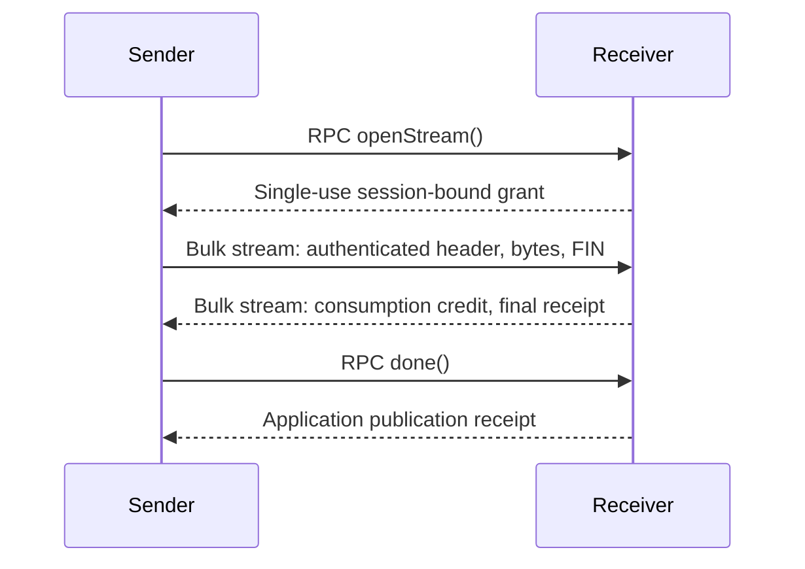

# Split control and bulk planes

Native QUIC can move explicitly authorized bulk payloads onto separate reliable
streams in the same mutually authenticated quiche connection. Capability RPC
stays ordered on stream 0, including pipelines, capability lifecycle messages,
three-party routing, transfer grants, cancellation and publication receipts.
Small calls remain inline. This is opt-in; arbitrary Cap'n Proto segments are
not moved to other streams.

| Traffic | QUIC mapping | Completion |
| --- | --- | --- |
| Capability RPC | Stream 0, urgency 0 | Existing RPC result/receipt contracts |
| Bulk payload | Client streams 4, 8, … or server streams 1, 5, …; urgency 200, incremental | Exact length and FIN, then a peer consumption receipt |
| Bulk consumption receipts | Reverse direction of each bulk stream, urgency 8 | Final receipt has FIN; stream remains tracked until Quiche collects it after acknowledgment |
| Native shutdown | Existing unidirectional streams 2/3, 6/7, 10/11, urgency 0 | Existing nonce and RPC byte fence, after bulk settles |
| Realtime | Existing bounded DATAGRAM lane | Unreliable; no reliable completion promise |



## Application API

Use `AuthenticatedSession::bulk()` before attachment, or
`native_rpc::Handle::bulk(peer)` on the selected authenticated route. It returns
`None` for TCP. The handle is weak: retaining it does not keep a connection alive
or retarget it to a replacement route.

For the existing in-memory `Transfer` service:

```rust
use capntproto::bulk::{split, Config, Receiver};
use std::time::Duration;

let timeout = Duration::from_secs(30);
let config = Config::new(length, 64 * 1024, 256 * 1024, 65_536)?;
let (receiver, transfer) = Receiver::new(config);
// Retain receiver in the application. Export transfer through normal RPC.
let transfer = split::enable(transfer, receiver_plane, timeout)?;

// The caller already holds that authorized remote capability. source is an
// AsyncRead with exactly the declared number of bytes and then EOF.
let summary = split::send(transfer, sender_plane, source, timeout).await?;
```

The receiver's plane must belong to the connection on which the sender will
send bytes; `sender_plane` is an `Option<Plane>`. A forwarded capability does not
automatically authorize use of another session. Acquire a fresh grant on the
appropriate route after a third-party handoff or reconnect.

`split::enable` decorates the existing capability and preserves its original
chunk validation and publication authority. The worker normalizes bytes into
`maxChunkBytes` chunks and awaits each underlying write acknowledgment. The
in-memory receiver still stages its declared value; only transport buffering is
independent of total transfer size. The adapter uses one bounded chunk buffer.

The optional `Transfer.openStream @4` method negotiates support without changing
existing method ordinals or ALPN `capntproto/3`. Older receivers return
`Unimplemented`, which selects ordinary `write` RPC. `None` selects ordinary RPC
directly, including TCP. Other errors never silently downgrade. Old senders can
still use `write` on the decorated service. Once a stream grant is issued,
ordinary writes and repeated grants are rejected; a prior ordinary write also
prevents switching to a stream halfway through the transfer.

`DurableTransfer` continues using its existing RPC/checkpoint path. Its hash,
resume and atomic revision receipt are unchanged. This release does not silently
substitute a stream receipt for durable publication.

## Low-level grants and bounds

`transport::bulk::Plane::receive(length, timeout)` returns an `Offer` and its sole
`Receive` reader. Deliver `Offer::encode()` only through an authorized RPC.
The sender decodes it with `Offer::decode`, consumes it with
`Plane::send(offer, timeout)`, writes exactly the declared bytes and consumes the
writer with `finish().await`. Dropping either endpoint cancels/revokes it.
The owned offer is deliberately neither `Clone` nor `Debug`; replay of copied
wire bytes is still rejected.

The reader and writer enforce their deadlines independently of network-driver
progress, including when UDP output is blocked. The driver reclaims canceled
entries when it resumes; retained slots and buffers remain bounded meanwhile.

| Limit | Bound |
| --- | --- |
| Active transfers | 8 total incoming/outgoing per session |
| Transfer length | At most 64 MiB; zero length is valid |
| Deadline | Required, greater than zero and at most 300 seconds |
| Application transport buffers | One 16-KiB pipe and one 16-KiB staging buffer per transfer |
| Unconsumed outgoing bulk | At most 256 KiB aggregate, further limited to half the peer's initial connection credit |
| Per-transfer outgoing credit | One eighth of that allowance, including an unconfirmed header; stalled transfers cannot spend another slot's allowance |
| Peer connection credit | At least 128 KiB to enable bulk, leaving at least 64 KiB outside the bulk allowance |
| Unauthenticated stream headers | At most 8 fixed 88-byte prefaces, each with a 5-second deadline |
| Grant replay metadata | A 64-grant sliding window, accepting reordered replies and rejecting old/reused grants |

Connection and stream flow control still enforce Quiche's own receive bounds.
These are application buffer/credit bounds, not a promise about total TLS,
Quiche, RPC, kernel or application memory. Consumption acknowledgments are
coalesced at 8 KiB (plus initial/final receipts), avoiding one receipt per tiny
application read. Bytes lacking a consumption receipt when a transfer fails
remain charged to that session's allowance. Repeated cancellations can therefore
exhaust bulk credit; reconnect creates a new allowance. Control RPC remains
available. `Plane::stats()` exposes active transfers, payload sent/received,
outstanding bytes and abandoned credit for diagnosis.

Grant IDs are independent of QUIC stream IDs. Dropping unused receive grants
does not consume QUIC stream slots. Streams are allocated only when a sender's
transfer is admitted by the driver, and are reset on failure. Unknown, forged,
truncated and oversized streams cannot publish application data.

## Wire and lifetime contract

An 88-byte offer contains `CTPBULK1`, a 32-byte session binding, a big-endian
64-bit grant ID, a big-endian 64-bit length, and a 32-byte random bearer key.
The grant ID's low bit identifies its issuer's QUIC role. The session binding is
SHA-256 over a domain tag, role-ordered authenticated identity keys and both
TLS-authenticated initial source CIDs (length-prefixed). A new handshake gets a
fresh binding, even with the same identities. Path migration/CID rotation within
the same connection retains the existing binding.

The stream header uses `CTPDATA1` with the same metadata and replaces the bearer
key with HMAC-SHA256 of its first 56 bytes. Verification checks the expected
metadata and uses constant-time tag verification. The grant key is zeroized on
drop. Reverse receipts are nine bytes: `A` or `F` followed by the big-endian
64-bit consumed-byte offset. Offsets must be monotonic and no greater than bytes
sent. `F` must match the declared length and end the reverse stream. The payload
FIN must also match the declared length exactly.

A successful `Send::finish` acknowledges peer reader consumption. It does not
prove processing, validation or durable commit. The bulk adapter waits for its
worker's write acknowledgments before forwarding `done`; only that RPC publishes.
Timeout, reset and cancellation do not imply rollback of an application mutation.

Graceful shutdown rejects new grants immediately and waits for all admitted
bulk transfers to settle. Successful streams remain tracked until their final
receipt and stream FIN have been acknowledged, so connection close cannot
overtake the receipt. Failed/canceled transfers report their own failure; shutdown
does not turn those failures into bulk success. The shutdown receipt's numeric
byte count still covers RPC input, not bulk bytes or application execution.

## Verification and performance scope

Run `cargo nextest run --locked -p capntproto --lib -E 'test(bulk::)'` for transport,
RPC compatibility and encrypted packet simulation tests. They cover both QUIC
roles, exact length, forged/replayed/stale grants, slot reclamation, stalled
readers, minimum connection credit, cancellation, loss, duplicates, reordering,
migration and crossed shutdown. TCP and old-peer fallbacks are exercised through
the real native RPC network.

Stream separation isolates per-stream gaps and unread consumers. All streams
still share congestion control, pacing, packet buffers, the executor and network
path; this is not a hard latency reservation. Mixed bulk/small-RPC p95/p99 and
throughput still require dedicated benchmark qualification. The existing
single-outstanding-call C++ comparison is a separate workload, and this change
does not establish the 1.2× target.
